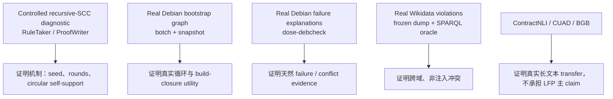

# LFP-MCGS 数据集分析与推荐方案

> 调研日期：2026-08-16
> 目标：为 LFP-MCGS 寻找权威、可复现、尽量真实且非 AIGC 的数据；优先使用天然存在的循环、失败或冲突，并由独立求解器给出可量化 ground truth。

## 1. 结论先行

最推荐的组合不是寻找一个“完美数据集”，而是用三层数据分别回答三个问题：

1. **受控机制层：RuleTaker / ProofWriter 派生的 recursive-SCC split**
   精确控制 seed、SCC size、fixed-point rounds 和 distractors，给出完整 LFP 与 proof oracle。它不是 AIGC，但仍是规则生成数据，因此只用来证明机制。
2. **真实主数据层：Debian Bootstrap + `botch` + `dose-debcheck`**
   使用真实 Debian package/source metadata、真实 build/install dependency cycles，以及官方工具产生的不可构建/不可安装解释。它最能复用 SA-MCGS 的 Debian 管线，也最接近“天然风险点 + 机器可验证标签”。
3. **跨域外部验证层：Wikidata ontology violations**
   用真实、人类维护的 `subclass of`、`instance of`、`disjoint with` 和 property constraints 构造传递闭包及冲突证明。标签由 SPARQL / 规则执行得到，不依赖 LLM 生成。

ContractNLI、CUAD、QuantLaw/BGB 和 SEC 数据仍可复用，但它们主要提供**真实文本或真实图拓扑**，没有 SCC 内 LFP 或天然冲突的精确标签。因此不建议继续像 Paper 1 那样把人工注入冲突作为主 ground truth；它们更适合 transfer / case study。

一句话数据策略：

> **Controlled semantics, real topology, solver-certified labels, and no LLM-generated ground truth.**

---

## 2. 先澄清：LFP 与“风险冲突”不是同一件事

Positive-Horn least fixed point 直接回答的是：

> 从一组 base facts 和规则出发，哪些 facts 最终可被推出？

它本身不自动表示“冲突”。要得到风险标签，需要显式规则，例如：

```text
selected(x) ∧ selected(y) ∧ conflicts(x, y) → violation(x, y)
instance(x, A) ∧ instance(x, B) ∧ disjoint(A, B) → violation(x)
```

因此每个数据源必须分别评估：

- 是否有真实循环图；
- 是否有可执行的单调闭包语义；
- 是否有天然的 failure / conflict 标注；
- 标签是人工判断、求解器证明，还是我们自行注入；
- 是否需要 negation、choice、版本约束等超出 positive Horn 的语义。

这一区分非常重要。Debian 的完整 installability 包含 alternatives、version constraints、Conflicts/Breaks 等约束满足问题，并不等于 pure positive-Horn LFP。论文必须把“核心 LFP task”与“真实 constraint-conflict external task”分层报告，不能为了故事完整而混淆语义。

---

## 3. 现有 SA-MCGS 数据审计

### 3.1 当前主实验到底有哪些真实成分

当前 manifest 位于 [`experiments/main_experiment/MANIFEST.json`](../experiments/main_experiment/MANIFEST.json)，包含 Debian、SEC EX-21、BGB 和 CUAD 四域。其主要特点是：

- 文本、节点和大部分图结构来自真实数据；
- 主风险标签来自 [`experiments/cross_domain/inject_defect.py`](../experiments/cross_domain/inject_defect.py) 的 `direct_mutex`、`handoff_invariant`、`temporal_gate`、`condition_trigger` 等模板；
- 注入位置位于真实 SCC 中，但冲突本身是人为构造；
- root、witness、risk type 和 affected nodes 由注入过程产生，而非数据源原生标注。

因此 Paper 1 可以合理声称“在真实领域图拓扑上做受控冲突实验”，但不能把这些 label 描述为 naturally occurring real-world conflicts。

### 3.2 四个已有域的可复用程度

| 现有域 | 真实内容 | 当前标签 | 对 LFP-MCGS 的适配 | 建议 |
|---|---|---|---|---|
| Debian packages | 官方 package metadata 与真实依赖图 | Paper 1 主要为注入冲突 | 很高；可改用 `botch` / `dose` 的真实 solver labels | **升级为主域** |
| BGB / QuantLaw | 真实法条与交叉引用 | 注入风险；无原生 LFP proof | 图可复用，但 citation cycle 不等于逻辑递归 | 只做小规模 transfer |
| CUAD | 510 份真实商业合同、律师监督 clause labels | clause type，不是逻辑冲突 | 文本权威，但需要另建规则图才有 LFP；不宜声称天然 SCC labels | evidence extraction transfer |
| SEC EX-21 | 真实公司/子公司披露或聚合关系 | 注入风险；无冲突 oracle | 所有权环可能是聚合/实体解析产物，语义不稳定 | 暂不进入主实验 |

本地 2024-10-27 Debian 快照经当前 extractor 得到约 63,701 个节点、276,938 条边与 65 个非平凡 SCC，可直接证明“真实图中存在可研究的环”。但当前 extractor 把 `A | B` alternatives 展开为多条普通边，也未完整编码 Conflicts / Breaks / version constraints，因此不能直接把它当 installability oracle。

---

## 4. 候选数据源总表

评分：5 表示非常适合，1 表示很弱。`天然标签` 指标签并非由本项目注入或由 LLM 生成。

| 数据源 | 权威/真实来源 | 天然 SCC | 精确 LFP gold | 天然失败/冲突 | 自然语言 | 推荐角色 |
|---|---:|---:|---:|---:|---:|---|
| Debian Packages/Sources + `botch` | 5 | 5 | 4 | 4 | 3 | **真实主数据** |
| Debian + `dose-debcheck` / `dose-builddebcheck` | 5 | 4 | 3 | 5 | 3 | **solver-certified conflict 主任务/外测** |
| RuleTaker / ProofWriter | 4 | 受控生成 | 5 | 1（逻辑标签，非真实风险） | 4 | **机制 benchmark** |
| Wikidata ontology + constraints | 5 | 4 | 5 | 4 | 2–3 | **跨域真实外测** |
| ContractNLI | 5 | 1–2 | 1 | 4 | 5 | 真实文本/evidence transfer |
| CUAD | 5 | 1–2 | 1 | 1 | 5 | clause extraction transfer |
| QuantLaw / C-DBR | 5 | 4 | 1 | 1 | 5 | 法律图 topology case study |
| deps.dev + OSV | 5 | 待 pilot | 4 | 4 | 2 | 软件风险传播外测备选 |
| Mancoosi CUDF | 4 | 3 | 4 | 5 | 1 | 旧 solver benchmark / sanity check |

---

## 5. 首选真实主数据：Debian Bootstrap + botch

### 5.1 为什么最适合

Debian 的依赖并非为论文生成，而是实际发行版构建与安装所需的 package metadata。循环依赖会造成真实的 bootstrap / build-order 问题。[Debian Policy 的 package relationships 章节](https://www.debian.org/doc/debian-policy/ch-relationships.html) 明确讨论 circular dependency 对安装与配置顺序的影响；Debian 的 [Bootstrapping wiki](https://wiki.debian.org/DebianBootstrap) 解释了从头构建发行版时的依赖环问题；官方 [`botch` package](https://packages.debian.org/stable/botch) 专门分析 dependency graph。

[`botch-print-stats`](https://manpages.debian.org/unstable/botch/botch-print-stats.1.en.html) 可以报告：

- cycles 与 selfcycles；
- strong dependency cycles；
- feedback arc / vertex sets；
- strong articulation points / bridges；
- missing dependencies。

[Debian Bootstrap 的实时 botch 分析](https://bootstrap.debian.net/botch-native/amd64/stats.html) 直接展示真实 source graph / build graph 的 SCC、feedback sets 和缺失依赖。这些是由发行版数据与独立图算法产生的天然结构标签，不是我们塞进去的一对冲突。

### 5.2 可定义的 pure-LFP 核心任务

冻结一个 Debian snapshot 后，把版本与 alternatives 的解析交给现有 Debian 工具，再建立以下 grounded positive-Horn program：

```text
available(binary_b).                         # 初始可用或 bootstrap seed

available(dep_1) ∧ ... ∧ available(dep_k)
    → buildable(source_s).                   # 构建依赖满足

buildable(source_s)
    → available(output_binary).              # 构建后产生 binary
```

查询可以是：

- `buildable(source_s)` 是否在 least fixed point 中；
- 某个 SCC 最终能推出多少 `available` / `buildable` facts；
- 为目标 source 返回一条 source-linked build proof；
- 给定无 seed 的循环，拒绝 `a → b → a` 自我启动；
- 给定一个真实 bootstrap seed，恢复跨若干 fixed-point rounds 的完整 closure。

Gold 由 deterministic semi-naive evaluator 产生；`botch` 给出真实 SCC 和候选 bootstrap cut / feedback points。LLM 的作用只是在 package descriptions、relationship records 或更自然的渲染文本中识别对应局部规则，不能修改 gold。

### 5.3 天然风险点如何量化

这里可以直接使用真实、非注入的目标：

- SCC 是否可由现有 seeds 启动；
- 目标 source 是否 buildable；
- 哪些缺失依赖阻塞了 closure；
- 哪些 feedback edges / vertices 是 bootstrap 的关键点；
- proof 是否覆盖独立工具给出的必要 dependency chain；
- 移除一个真实 seed 后，closure 减少多少。

建议把 “risk” 更精确地命名为 **bootstrap blockage / unresolved build closure**，避免把所有 dependency cycle 一概说成错误。环本身未必有害；真正有风险的是没有可用 seed、存在缺失依赖，或构建顺序无法满足。

### 5.4 与 SA-MCGS 的复用

可直接复用：

- Debian snapshot 下载与 parser；
- dependency graph、Tarjan SCC 与 SCC sampling；
- 局部 window、UCB、virtual loss、transposition table；
- trace / cost runner 与多模型调用接口。

必须重写或增强：

- 正确解析 `Depends`、`Pre-Depends`、`Build-Depends`、alternatives、version 和 virtual packages；
- 接入 `botch` / `dose` 输出，而不是把 alternatives 当作全部同时成立；
- 新建 atom/rule schema、incremental LFP engine、proof map 与 verifier；
- 将 Paper 1 的 injected risk metadata 从主标签链路移除。

---

## 6. 天然冲突主任务：Debian dose-debcheck

Debian QA 的 [dose debcheck](https://qa.debian.org/dose/debcheck.html) 定期检查真实仓库中的 package installability。官方定义要求递归依赖可满足且不存在冲突。[`dose-debcheck` manpage](https://manpages.debian.org/bookworm/dose-distcheck/dose-debcheck.1.en.html) 说明其求解器处理 Depends、Pre-Depends、Conflicts、Breaks、Provides、alternatives 与版本约束，并可用：

- `--explain --failures` 输出从查询包到 missing package / conflict 的解释链；
- `--dot` 输出解释图。

Debian QA 的 [真实 failure report 示例](https://qa.debian.org/dose/debcheck/src/five-or-more.html) 展示了自然发生的 unsatisfied dependencies / conflicts。

这正好解决 Paper 1 的标签问题：

- 输入来自真实发行版；
- failure 并非人工注入；
- label 与 explanation 由独立完备 constraint solver 产生；
- 可对我们返回的 evidence subgraph 做自动验证。

### 6.1 语义边界

完整 installability 是带析取与负约束的 constraint problem，不是 pure positive Horn。因此建议两种使用方式：

1. **主文核心 LFP task**：只在 `botch`/`dose` 已解析后的 buildability/availability program 上做 LFP；
2. **真实 conflict external task**：把 `dose` explanation graph 当 solver-certified certificate，评估 LFP-MCGS 风格 scheduler 能否在自然语言化记录中找齐解释，但明确称为 constraint extension。

不要把 `dose` 的完整求解过程包装成 Horn LFP，也不要声称我们比成熟 solver 更会算 installability。论文问题是：当约束来自长文本、读取成本昂贵时，如何恢复足够的可验证程序与证据。

---

## 7. 受控机制数据：RuleTaker / ProofWriter

[RuleTaker](https://www.ijcai.org/Proceedings/2020/537) 与 [ProofWriter](https://aclanthology.org/2021.findings-acl.317/) 提供 Datalog-style facts/rules、entailment labels 与 proof information，适合自动产生精确 LFP gold。

它们的优点：

- 不是由生成式 AI 产生标签；
- 规则和 truth 可由 symbolic engine 完全校验；
- 文本比纯结构化 Debian/Wikidata 更接近 NLP benchmark；
- 可以构造严格 matched counterfactual pairs。

但它们仍是合成/受控数据，不能替代真实域。正确用途是构造一个新的、明确标注为 diagnostic 的 recursive-SCC split：

1. 从原始 fact/rule program 计算 predicate / atom dependency graph；
2. 保留或组合形成长度可控的 productive SCC；
3. 生成 `seeded` 与 `unseeded` matched pair；
4. 用 symbolic evaluator 计算完整 LFP、round index 与 proof；
5. split 按 topology、rule template 和 paraphrase family，而不是随机句子划分；
6. 不让 LLM 生成题目或 ground truth。

控制轴建议包括：

- SCC size：4 / 8 / 16 / 32；
- fixed-point rounds：2 / 4 / 8 / 16；
- rule body arity：1 / 2 / 3；
- relevant seed：存在 / 缺失 / 仅 distractor SCC 有 seed；
- query position：SCC 入口 / 中部 / 最后一轮；
- irrelevant rules 与跨 SCC predecessors；
- held-out natural-language paraphrase。

需要诚实说明：若 recursive SCC 是我们在原 program 上确定性重组得到的，它仍属于研究者构造的 diagnostic benchmark；优势是形式化、可复现、无需 AIGC，不应称作 naturally occurring conflict。

---

## 8. 跨域真实外测：Wikidata ontology violations

Wikidata 是真实、人类共同维护的知识库，结构化数据采用 CC0。其 ontology 文档明确涉及 [`subclass of` 与 class cycles](https://www.wikidata.org/wiki/Wikidata:WikiProject_Ontology/Classes)，property constraint 系统也产生公开的 [constraint reports](https://www.wikidata.org/wiki/Property_talk:P2302)。

可以定义：

```text
instance(x, c) ∧ subclass(c, d) → instance(x, d)
subclass(a, b) ∧ subclass(b, c) → subclass(a, c)
instance(x, A) ∧ instance(x, B) ∧ disjoint(A, B) → violation(x)
```

[Disjointness Violations in Wikidata](https://arxiv.org/abs/2410.13707) 展示了如何用 SPARQL 找到真实 internal contradictions 及其 culprit statements。可据此创建冻结 snapshot：

- facts/rules 来自真实 Wikidata statements；
- conflict label 由 SPARQL / deterministic rule engine 生成；
- evidence 是具体 statement IDs 与 subclass paths；
- 只筛选 proof path 穿越非平凡 SCC 或需要多轮 closure 的样本。

它能给论文一个很强的“真实冲突、非注入”外测，但有三点限制：

- 输入主要是 triples/labels，不是完整自然语言文档；
- Wikidata cycles 有时本身是 ontology modeling errors，需要冻结版本并保留 provenance；
- 全图规模巨大，必须先做 SCC 与 proof-length pilot，确认有足够目标样本。

因此建议把它作为第二真实域，而不是唯一主数据。

---

## 9. 其他真实数据的价值与限制

### 9.1 ContractNLI

[ContractNLI](https://stanfordnlp.github.io/contract-nli/) 包含真实合同、document-level entailment / contradiction / unknown labels 和人工 evidence spans。它非常适合验证：局部自然语言抽取和 proof evidence 是否能迁移到真实法律文本。

但其标签围绕固定 hypotheses，文档没有权威 recursive rule graph，也不天然提供 SCC / LFP rounds。当前 repo loader 生成的交叉引用与相邻边带有启发式成分。因此它只能回答“真实文本上的证据恢复”，不能证明 cycle-native LFP 能力。

### 9.2 CUAD

[CUAD](https://www.atticusprojectai.org/cuad/) 有 510 份真实商业合同、13,000+ 律师监督标签与 41 种 clause categories。权威性和文本真实性很高，但 labels 是 clause extraction，不是冲突、递归规则或 proof closure。

建议把 CUAD 用作：

- 测试 local NL → relation/rule extraction；
- 评估 evidence span grounding；
- 展示相同 scheduler 能处理长合同。

不建议在没有专家重新标注的情况下把 CUAD 变成主 LFP benchmark。

### 9.3 QuantLaw / C-DBR / BGB

[QuantLaw](https://doi.org/10.5281/zenodo.4660133) 与 [C-DBR](https://zenodo.org/records/7494474) 提供来自官方法律来源的真实法规文本与交叉引用，适合复用 Paper 1 的 legal SCC topology。

问题是 citation cycle 不等于 semantic recursion：A 引用 B、B 引用 A，并不意味着存在 `A → B → A` 的 Horn rule firing。若没有法学专家或官方判例给出 entailment/conflict gold，它们只能做定性 case study，不能承担主量化结论。

### 9.4 deps.dev + OSV

[deps.dev API](https://docs.deps.dev/api/v3/) 聚合官方 package registries 与依赖信息；[OSV API](https://google.github.io/osv.dev/api/) 提供真实 vulnerability advisories 和受影响版本。可以测试“已知 vulnerable seed 沿真实 dependency closure 传播”的任务。

优点是跨 npm / Maven / PyPI / Cargo 等生态，版本和漏洞标签真实。风险是 resolved dependency graph 中的非平凡 SCC 可能很少，而且 “transitively depends on vulnerable package” 不等于实际可利用。必须先统计 SCC 数量，再决定是否加入。

### 9.5 Mancoosi CUDF

[Mancoosi International Solver Competition](https://www.mancoosi.org/misc-live/) 提供真实 package-upgrade / installability problems 和标准 CUDF 表示，适合做 solver sanity check。缺点是数据较旧、没有自然语言，并且与现代 Debian 数据重复；建议只作为 supplementary benchmark。

---

## 10. 推荐的最终数据组合



### 10.1 主表应该如何组织

建议主论文只放三块：

1. **Recursive-SCC Diagnostic**：最清楚的 causal mechanism；
2. **Debian Bootstrap**：主真实数据与真实 SCC；
3. **Debian Natural Failures 或 Wikidata Violations**：至少一个天然 conflict 外测。

ContractNLI/CUAD/BGB 只选一个做 appendix case study，避免范围再次变大。

### 10.2 训练、开发、测试切分

- 按 SCC topology hash 切分，避免同构图泄漏；
- Debian 按 snapshot time 或 package source family 切分；
- Wikidata 按 ontology branch / entity family 切分；
- paraphrase template 与实体名均做 held-out；
- matched positive/negative 必须留在同一 split；
- 所有 solver output、snapshot checksum、filter script 和 reject reason 随数据发布。

### 10.3 主要指标

- query answer accuracy：`ENTAILED / NOT ENTAILED / UNKNOWN`；
- proof-carrying accuracy：答案正确且 certificate 通过独立 verifier；
- closure recall / precision 与 exact closure；
- SCC endpoint / seed coverage；
- fixed-point round recovery；
- natural failure explanation recall / all；
- circular self-support false-positive rate；
- calls、tokens、wall time 与 time-to-first-valid-proof；
- accuracy–cost Pareto，以及相对 `extract-all + solver` 的节约。

---

## 11. 两周数据 pilot

### Week 1：Debian 可行性

1. 冻结一个 Debian Snapshot 时间点，记录 Packages、Sources、Release checksum；
2. 用官方 `dose`/`botch` 正确解析 alternatives、versions、virtual packages 与 build dependencies；
3. 导出 source/build graph、SCC、feedback sets 与 failure explanations；
4. 构造纯 LFP buildability program，并用本地 semi-naive engine复算 closure；
5. 对当前简单 extractor 与官方工具的图做 diff，量化 Paper 1 数据管线的语义偏差。

最低 GO 条件：

- 至少 100 个 query-relevant 非平凡 SCC instances；
- 至少两个有效 fixed-point rounds，且有一批 4–16 rounds 的 hard cases；
- 至少 50 个真实 failure / blockage cases 带可解析 explanation graph；
- 能构造 topology-matched buildable / blocked queries，而不注入虚构依赖。

### Week 2：跨域与 benchmark

1. 从 RuleTaker/ProofWriter 生成 200–300 个 deterministic recursive-SCC diagnostic cases；
2. 冻结一个 Wikidata dump subset，统计 subclass SCC 与 disjointness violations；
3. 只保留 proof 穿越 SCC 或至少需要三轮 closure 的 case；
4. 跑 `full NL→program once`、`extract-all + solver`、deterministic SCC traversal 三个强 baseline；
5. 决定真实第二域是 Wikidata 还是 Debian natural failures。

最低 GO 条件：

- diagnostic 中 seeded/unseeded matched accuracy gap 可被稳定测量；
- 真实域至少 100 个可验证 case；
- verifier 对所有 gold certificate 100% 通过；
- LLM 不参与标签生成；
- LFP-MCGS pilot 相对 deterministic / extract-all baseline 显示至少一个明确优势：更高 proof-valid accuracy，或以不超过 60% 的解析调用达到其 95% 以上准确率。

若达不到这些条件，应把 Paper 2 收窄为“controlled fixed-point reasoning benchmark + method”，不要同时承诺法律、软件和知识图谱三域。

---

## 12. 最终建议

### 必选

- **Debian `botch` / `dose`**：解决真实 SCC 与天然失败标签问题；
- **RuleTaker / ProofWriter recursive split**：解决精确 LFP、matched causal control 和 proof oracle 问题。

### 有条件加入

- **Wikidata violations**：pilot 后若 SCC-crossing violation 数量足够，则作为第二真实域；
- **ContractNLI**：若时间允许，作为真实法律文本 evidence transfer。

### 不建议作为主数据

- 继续以 BGB/CUAD/SEC 上的人工注入冲突作为主结论；
- 只用 citation graph 就声称 recursive reasoning；
- 用 LLM 生成规则、冲突和解释再由同类 LLM 评测；
- 把完整 Debian installability 误写为 positive-Horn LFP。

最稳的论文叙事是：

> Paper 1 在真实领域图的受控注入风险上验证了 SA-MCGS 的循环证据搜索能力；Paper 2 不再依赖注入标签，而是在受控逻辑程序上精确测量 fixed-point mechanism，并在 Debian 的真实依赖环和 solver-certified failures 上验证实际价值。
