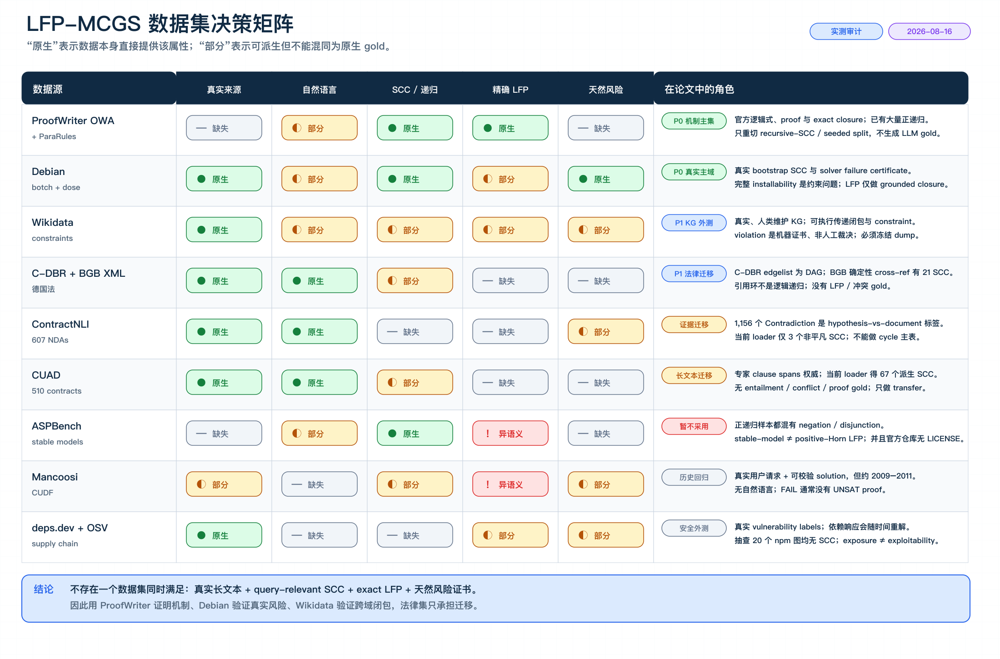
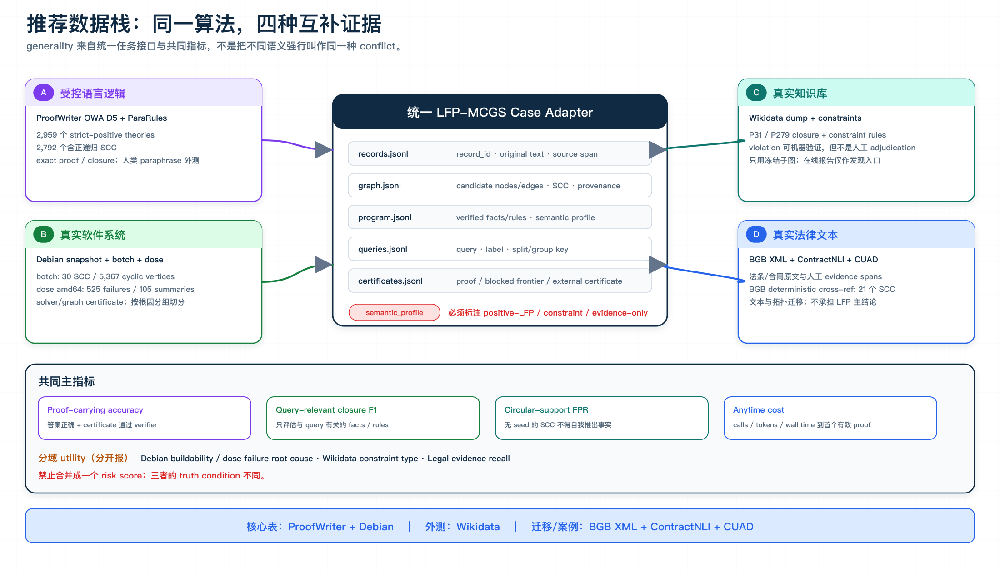

# LFP-MCGS 数据集实测审计

> 审计日期：2026-08-16
> 口径：实际下载、解压并解析候选数据；严格区分数据原生标签、我们可确定性派生的标签，以及当前 SA-MCGS loader 生成的图。



## 1. 最终选择

| 优先级 | 数据 | 论文角色 | 采用结论 |
|---|---|---|---|
| P0 | [ProofWriter OWA D5 / ParaRules](https://allenai.org/data/proofwriter) | 语言规则机制主集 | **直接采用**；从官方数据重切 query-relevant recursive-SCC 子集，不注入冲突 |
| P0 | [Debian snapshot](https://snapshot.debian.org/) + [`botch`](https://bootstrap.debian.net/botch-native/amd64/stats.html) + [`dose`](https://qa.debian.org/dose/debcheck.html) | 真实软件主域 | **采用**；botch 提供真实 bootstrap SCC，dose 提供天然 failure 与解释证书 |
| P1 | [Wikidata constraints](https://www.wikidata.org/wiki/Help:Property_constraints_portal) | 真实知识库外测 | **冻结后采用**；做 P31/P279 closure 与 constraint verification，不依赖 live WDQS |
| P1 | [BGB XML](https://www.gesetze-im-internet.de/bgb/xml.zip) + ContractNLI + CUAD | 法律文本迁移 | **只做 transfer / case study**；没有原生 LFP 或内部冲突 gold |
| 不进主表 | ASPBench、SLR-Bench、Mancoosi、deps.dev+OSV | 语义边界或补充 | ASPBench 语义不兼容；其余缺自然语言、SCC 或当前性 |

硬结论：没有一个现成数据集同时具备 **真实长文本、query-relevant SCC、exact LFP、天然风险证书**。最稳的组合是：

> ProofWriter 证明机制，Debian 验证真实风险，Wikidata 验证跨域闭包，法律集只验证语言与拓扑迁移。

## 2. 审计口径

一个数据只有在下列属性由原始发布方直接提供时，才记为“原生”；运行 Tarjan、规则求值器或当前 loader 得到的结果均记为“派生”。

| `semantic_profile` | 可比较的 truth condition | 代表数据 |
|---|---|---|
| `positive_lfp` | finite positive Horn 的 least fixed point | ProofWriter 正规则子集；grounded Debian closure；Wikidata P31/P279 |
| `constraint` | AND-of-OR、版本、冲突或 stable-model 等约束语义 | Debian dose、Mancoosi、ASPBench |
| `evidence_only` | 人工 span / NLI label，但无可执行闭包 | ContractNLI、CUAD、BGB/C-DBR |

这三类可以共享搜索器和 evidence interface，但不能合并成一个 `risk score`。

## 3. 逐项实测

### 3.1 ProofWriter：最合适的机制与 NLP 数据

[ProofWriter（Findings ACL 2021）](https://aclanthology.org/2021.findings-acl.317/)同时发布自然语言、canonical facts/rules、`True / False / Unknown`、proof intermediates 与可推导结论。ParaRules 是人工众包改写，底层世界仍是程序生成，不能称为真实业务文本。

SCC 口径：只保留所有 atom polarity 为正的 Horn rule，在 predicate-level `body → head` 图上计算 SCC；proof 必须实际使用 SCC 内规则。

| 切片 | theories / queries | strict-positive theories | 含正递归 SCC | proof 用 SCC | 同一 SCC 内 ≥2 rules |
|---|---:|---:|---:|---:|---:|
| OWA D5 | 4,752 / 100,030 | 2,959 | 2,792 | 24,966 | 18,185 |
| OWA ParaRules | 2,403 / 40,022 | 2,403 | 1,777 | 8,791 | 4,584 |

OWA D5 标签为 `28,512 True / 28,512 False / 43,006 Unknown`；ParaRules 为 `10,006 / 10,006 / 20,010`。

直接生成两个不注入标签的子集：

- `PW-SCC-Core`：strict positive，query proof 至少使用一条 SCC-internal rule；
- `PW-SCC-Deep`：同一 proof 至少使用两条同 SCC 内部规则；
- `PW-DAG-Matched`：按 facts、rules、query depth 与 context length 匹配的 DAG 对照；
- 官方 split 按 theory 保持隔离；ParaRules 必须按 `mappings → sentN` 保留完整人工句子。

主要问题：ProofWriter/RuleTaker 数据归档内没有独立 LICENSE。论文内实验可引用官方下载；如果重新发布筛选后的 JSONL，先向 AI2 确认再分发许可。RuleTaker 是旧格式兼容性检查，不算第二个独立领域。

### 3.2 Debian：真实主域，但必须分清 LFP 与 constraint

本次抓取的 Debian unstable 索引通过 `InRelease` SHA-256 校验：

| 索引 | 实测规模 | 与循环/风险相关字段 |
|---|---:|---|
| `Packages_amd64.xz` | 76,522 binary stanzas；75,950 unique names | 67,298 Depends；612 Pre-Depends；3,196 Conflicts；8,441 Breaks；14,669 Provides |
| `Sources.xz` | 42,291 source stanzas；41,155 unique sources | 42,268 Build-Depends；7,559 Build-Depends-Indep；350 Build-Conflicts |

粗 name graph 只用于确认 topology，不能当 installability gold：

| 投影 | 非平凡 SCC | cyclic nodes | 最大 SCC |
|---|---:|---:|---:|
| binary，单一候选依赖 | 60 | 180 | 21 |
| binary，union 所有 alternatives | 78 | 239 | 21 |
| source → producer，单一候选 | 91 | 6,152 | 5,710 |
| source → producer，union alternatives | 92 | 6,230 | 5,786 |

官方 `botch` 输出给出更可靠的 bootstrap 结构：

- source graph：18,649 vertices、1,020,837 edges；type-1/2/3 self-cycles 为 `26 / 46 / 2`；
- build graph：41,536 vertices、1,162,991 edges；30 个非平凡 SCC、5,367 个 cyclic vertices；最大 SCC 为 5,277；
- 153 个 feedback-arc candidates、2,412 个 missing-build-dependency records、1,200 strong articulation points、4,163 strong bridges。

这里不是 30 个独立同分布案例：最大 SCC 占绝大多数。应在大 SCC 内以 source query 的 dependency/evidence cone 切实例，并按 source family 分组切分。

官方 `dose` 的 amd64 报告有 525 个不可安装 package，但只有 105 个不同短解释：450 个 missing dependency、75 个 conflict；其中 67 个 conflict 都归因于同一个 `libgjs0 ↔ gnome-shell` 根因。不能把 525 行当作 525 个独立冲突样本，必须按 explanation/root-cause cluster 去重与 group split。

语义边界：

```text
固定 concrete dependency choice 后：
available(d1) ∧ ... ∧ available(dk) → buildable(source)
buildable(source) → available(output)
```

上面是 positive-Horn LFP。完整 installability 还包含 alternatives、version inequalities、Provides、architecture/profile 与 Conflicts/Breaks，是约束满足问题。[`dose-debcheck`](https://manpages.debian.org/unstable/dose-distcheck/dose-distcheck.1.en.html)应作为 grounder / verifier，而不是被错误改写成普通 LFP。

本次 live 文件还存在时间错位：索引为 2026-08-15 14:07 UTC，dose 为 2026-08-15 05:00，botch 为 2026-08-12。正式实验必须从 [snapshot.debian.org](https://snapshot.debian.org/)固定同一时间点，再本地重跑 dose/botch。

### 3.3 Wikidata：可执行闭包外测，不是主 benchmark

可用 positive rules：

```text
instance(x, A) ∧ subclass(A, B) → instance(x, B)
instance(x, A) ∧ instance(x, B) ∧ disjoint(A, B) → violation(x, A, B)
```

实际审计发现：

- 2024 disjointness release 的 `AllCulprits.csv` 有 14,657 条数据行、14,420 个 unique QID、51 组 disjoint settings；可由 symbolic rule 逐条验证；
- 2026-07-22 QLever dump 与当前 WDQS 均返回 44 对直接双向 `P279` 环，即 88 个不同节点；它们与上述 culprit 集只重合 2 个 QID；
- 同一 gas/liquid 设置从 2024 的 9 violating classes / 7 culprits 漂移到 2026 的 6 / 4；
- live WDQS 的全局 transitive query 多次超时/504；在线 constraint report 会变化；
- culprit 是机器产生的 violation certificate，不是专家确认“数据确实错误”的人工 gold。

因此只做 structured external domain：冻结 dump/revision，保留完整 P31/P279/disjointness provenance，构造 matched non-violation，并按 entity/class family 切分。不能用“Wikidata 有环”直接等同于“冲突发生在该环上”。Wikidata 数据为 CC0。

### 3.4 法律数据：真实文本强，LFP gold 弱

| 数据 | 原生监督 | 当前实测图 | 结论 |
|---|---|---|---|
| [ContractNLI](https://stanfordnlp.github.io/contract-nli/) | 607 NDAs × 17 hypotheses = 10,319 标签；11,973 evidence references | 当前 loader：38,473 nodes / 751 edges；仅 3 个 size-2 SCC | contradiction 是 hypothesis-vs-document NLI，不是文内规则冲突；只做 evidence transfer |
| [CUAD](https://www.atticusprojectai.org/cuad/) | 510 真合同、41 clause types、20,910 QA、13,823 answer spans | deterministic loader：8,972 nodes / 3,816 edges；67 个派生 SCC | 图不是原生标注，无 entailment/conflict/proof gold；只做长文本 transfer |
| [C-DBR](https://zenodo.org/records/20595558) 2026-07-09 | 德国联邦法原文与网络，CC0 | 1,443 个 edgelist：16,541 endpoint nodes / 15,096 edges / **0 SCC** | 发布的 network 是法规内部目录层级 DAG，不是交叉引用图 |
| [BGB official XML](https://www.gesetze-im-internet.de/bgb/xml.zip) | 2,500 sections 与显式 `§` references | 1,619 个引用端点 / 2,382 unique edges；21 SCC / 101 cyclic nodes；max=25 | 可做 topology case；citation cycle 仍不等于 logical recursion |
| [QuantLaw](https://zenodo.org/records/4660133) | 法律 cross-reference graphs | 本地 DE 子集有 23 SCC | 完整包 17.7 GB，CC BY-NC-ND；新项目优先 C-DBR/BGB，不再扩下载 |

额外注意：Paper 1 的 CUAD LLM fullgraphs 中，大 SCC 主要受 implicit term co-usage edges 影响；它们是模型构图结果，不能称为数据天然 SCC。

### 3.5 不进入核心实验的数据

| 数据 | 下载后发现 | 处理 |
|---|---|---|
| [ASPBench](https://proceedings.kr.org/2025/60/) | 三个主任务各 1,000 programs；`positive ∩ recursive = 0`；递归案例都混有 default negation/disjunction；仓库无 LICENSE | stable-model ≠ positive-Horn LFP，当前弃用 |
| [SLR-Bench](https://aclanthology.org/2026.acl-long.16/) | 19,253 rule-induction tasks；self-recursive rule = 0；25.2% 标为 LLM-guided sampling | 任务与非 AIGC 偏好均不匹配，弃用 |
| [Mancoosi CUDF](https://doi.org/10.5281/zenodo.3556644) | 抽取的真实请求含 47–92 个 name-level SCC；可校验 solution，但约 2009–2011、无 NL、FAIL 通常无 UNSAT core | 仅历史 solver regression |
| [deps.dev](https://docs.deps.dev/api/v3/) + [OSV](https://google.github.io/osv.dev/api/) | 抽查 20 个当前热门 npm graph，全部 0 个非平凡 SCC；OSV 有真实漏洞，但 transitive exposure ≠ exploitability | 仅安全 reachability 外测 |

## 4. 推荐数据栈与统一接口



统一 case schema：

```text
records.jsonl       record_id, original_text, source_span
graph.jsonl         candidate nodes/edges, SCC, provenance
program.jsonl       verified facts/rules, semantic_profile
queries.jsonl       query, label, split_key, group_key
certificates.jsonl  proof | blocked_frontier | external_certificate
```

共同主指标只评估所有域都能严格定义的部分：

- proof-carrying accuracy；
- query-relevant closure F1；
- circular-support FPR：无 seed 的 SCC 不得自我推出事实；
- calls / tokens / wall time 到首个有效 certificate。

分域 utility 单独报告：Debian buildability/root cause、Wikidata constraint type、法律 evidence recall。

## 5. 最小落地顺序

1. 先完成 `PW-SCC-Core / Deep / DAG-Matched` 索引与 exact verifier；这是最干净的算法 go/no-go。
2. 冻结单一 Debian snapshot，本地重跑 botch/dose；按根因聚类后再选 query cones。
3. 只有前两项证明 MCGS 调度优于 exhaustive / SCC-only / MCTS-no-merge 后，再冻结 Wikidata 子图。
4. ContractNLI、CUAD、BGB 只跑小规模 transfer；不为追求“四域主表”重新注入冲突。

## 6. 可复现资产与完整性

- 下载缓存：`dataset_audit/raw/`，本地保留但被 Git 忽略；
- 现有 SA 数据复算脚本：[`dataset_audit/audit_existing_sa_datasets.py`](./dataset_audit/audit_existing_sa_datasets.py)；
- 图生成脚本：[`dataset_audit/figures/generate_dataset_figures.mjs`](./dataset_audit/figures/generate_dataset_figures.mjs)；
- 关键下载校验：

| 文件 | SHA-256 |
|---|---|
| ProofWriter `V2020.12.3.zip` | `bbc5694901e8306d0bd659aa1ad53ccfd02c201864f4b320ffa3777827d1fc26` |
| RuleTaker `V2020.2.5.zip` | `080c8bca836603d9fea040e5a242bbd281f631255ca83428b7141ebf7f3deb0c` |
| Debian `Packages_amd64.xz` | `de3487c1069cbc81636d9e1fcd689e8ec0fabc6b05db8944053fba67814a64c3` |
| Debian `Sources.xz` | `f2d60a7c2e6c132397cda47b0c87d7de13fcd8601f8bdc3b15b63a8492b19d6e` |
| botch live stats JSON | `d19468ed88b826fff61155b3a68b74c1f6af7f4c36e1f2cb61eb5c00865e7b98` |
| Wikidata `AllCulprits.csv` | `d2a24fa3a17211960e0beae3bbe5651bec1bd67cc3410ffe43ca58fe47f6aa22` |
| C-DBR network archive | `6df7146af448b49738a5f71576c714a6473c0149ae4b31ebfe346c0ea5e99782` |

结论可信度边界：这些统计证明“数据是否适合当前任务”，不证明模型效果；后者必须通过预算匹配的 exact/semi-naive、exhaustive extraction、SCC-only、MCTS-no-merge 与 LFP-MCGS 实验决定。
