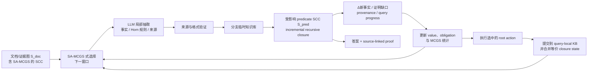
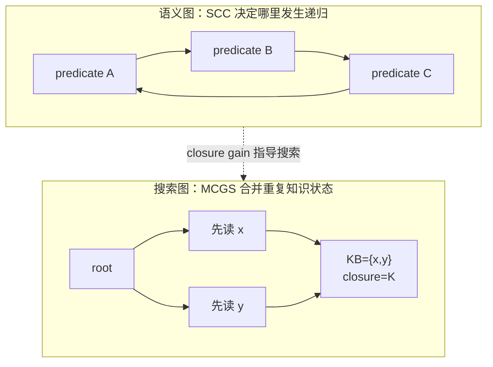
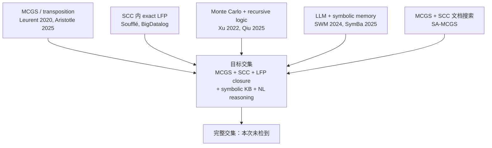
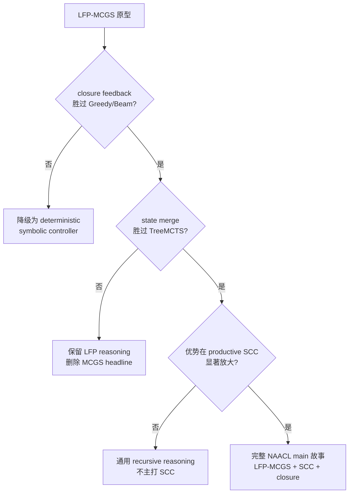

# LFP-MCGS（Recursive Closure）：文献调研与 NAACL 判断

> 更新：2026-08-16
>
> 目标：判断 **SCC 上的 MCGS + least-fixed-point recursive closure** 是否已有同类工作，以及它是否足以成为一篇独立的 NAACL 论文。
>
> 说明：本次看的是概念等价工作，不是只搜 “LFP-MCGS” 这个名字；“未找到”不等于数学意义上的不存在。

## 0. 先看结论

| 问题 | 结论 |
|---|---|
| 有没有完全相同的前人工作？ | **没有检到。** 尚未发现工作同时具备：严格状态合并的 MCGS、predicate-SCC、least-Herbrand LFP、分支内 symbolic KB、安全的跨路径复用、recursive closure 反馈与自然语言规则推理。 |
| 单独的组件新吗？ | **不新。** MCGS、SCC 内求 LFP、symbolic memory、Monte Carlo + recursive logic 都有先例。 |
| 这个组合有研究价值吗？ | **有，而且比“SA-MCGS 的效率优化”更像独立论文。** 新问题是跨 rollout 的证明组合：多个局部访问各自不足，合并后才经 recursive closure 推出答案。 |
| 有 NAACL main 潜力吗？ | **有条件地有。** 若能证明 closure feedback、state merging、SCC 三者各自必要，并胜过 SymBa、Greedy/Beam、TreeMCTS、Extract-All+LFP，则故事足够完整。 |
| 最大误区是什么？ | 把工作写成“用 MCGS 加速 LFP”。已知符号程序的 LFP 已有成熟 exact 算法；我们的新意应是 **LFP 成为 MCGS 的知识状态与反馈信号**。 |

一句话判断：

> **SA-MCGS 解决“在 SCC 里到哪里搜索”；LFP-MCGS 解决“不同 rollout 找到的证明碎片，怎样在 SCC 里组合成有依据的 recursive closure”。**

---

## 1. 从 SA-MCGS 到 LFP-MCGS，究竟增加了什么？

### 1.1 大白话版本

- SA-MCGS 每次查看一个局部窗口，累计“哪里可疑”的软证据。
- LFP-MCGS 每次查看窗口后，抽取可执行的事实和规则，放进一个有来源记录的知识库。
- 新事实进入后，只在受影响的递归 SCC 中继续推导，直到不再产生新事实；最终集合就是 LFP。
- 新增事实、未满足前提和证明进度再告诉 MCGS：下一步最值得看哪里。



这里最重要的状态不是“当前在哪个节点”，而是：

```text
状态 = 已确认的事实/规则 + 当前 LFP 闭包 + 证明缺口 + 已读范围 + 剩余预算
```

不同搜索顺序若得到完全相同且决策等价的状态，MCGS 才共享 visit/value。这是它与普通树搜索真正不同的地方。**不能只按当前 closure 合并**：两个规则集合现在可能推出同样事实，未来加入同一个 seed 后却产生不同结果；因此 key 至少还要包含规范化规则、剩余候选/coverage 与预算状态。

### 1.2 recursive closure 在这里是什么？

`recursive closure` 不是 LFP 外面再加的一个算法。它是**得到 LFP 的过程**：从有根据的 seed facts 出发，反复应用递归规则，直到没有新事实。


没有 seed 时，`a → b` 与 `b → a` 什么也推不出来。这个简单性质让 LFP-MCGS 能避免 **cycle 自己证明自己**。

本论文真正可讲的新机制是：

> recursive closure 不只在搜索结束后运行；每个已执行 rollout 是一笔 evidence transaction，它更新知识状态，并把 closure frontier 反馈给下一轮 MCGS。

---

## 2. 为什么 SCC 在这篇里仍然是核心？

这里实际有两类 SCC，论文中必须分开写：

| 名称 | 它在哪里 | 它负责什么 |
|---|---|---|
| `S_doc` | 原始文档/证据依赖图 | SA-MCGS 在这里搜索窗口；这是 Paper 1 已验证的能力。 |
| `S_pred` | 已提交 Horn 规则的 predicate-dependency graph | LFP 在这里做多轮 recursive closure；这是 Paper 2 新增的语义层。 |

二者可能相关，但不是同一张图。SCC 也不是为了把论文限制在一个小场景，而是提供三种普通链式推理不明显的困难。

| SCC 中的困难 | LFP-MCGS 的对应机制 |
|---|---|
| 一条规则单看没有收益，凑齐 seed、bridge、feedback rule 后闭包才突然增长 | multi-step rollout 与 closure-aware value |
| 同一知识状态可由不同读取顺序到达 | MCGS transposition/state merging |
| 无 seed 的环看起来“互相支持” | least-fixed-point 从 grounded facts 出发，禁止 circular self-support |



注意：上面是两张图。

- SCC 位于 **规则依赖图**。
- MCGS 的 merge 位于 **知识状态搜索图**。

我们不是因为图里有环就把算法叫 MCGS；而是因为多条搜索轨迹会汇合到同一个知识状态，并共享统计量。

---

## 3. 文献地图：哪些部分已经有人做过？



### 3.1 最接近、必须正面讨论的工作

<details>
<summary>展开逐篇文献对照</summary>

| 工作 | 它已经覆盖了什么 | 为什么还不是 LFP-MCGS |
|---|---|---|
| [SA-MCGS](https://github.com/chenqianwan/SA-MCGS) | MCGS + Tarjan SCC + 循环文档风险搜索 | 没有可执行 Horn 程序、LFP、recursive closure 或 proof semantics；它是 Paper 2 的方法基础，不是重复工作。 |
| [Leurent & Maillard, ACML 2020](https://proceedings.mlr.press/v129/leurent20a.html) | 原始 MCGS：合并不同轨迹到达的相同/相似状态 | fixed point 属于数值 Bellman 语境，不是 least-Herbrand recursive closure。 |
| [Soufflé, CC/CAV 2016](https://www.souffle-lang.com/pdf/cc.pdf) | predicate dependency SCC、semi-naive delta、每个 SCC 内求 fixed point | 完整符号程序已经给定；没有 LLM、Monte Carlo search 或跨 rollout 知识状态。 |
| [BigDatalog, SIGMOD 2016](https://doi.org/10.1145/2882903.2915229) | 大规模递归 Datalog 与 distributed semi-naive fixed point | 同样是 exact executor，不处理自然语言证据搜索。 |
| [Xu & Lieberherr, NFM 2022](https://link.springer.com/chapter/10.1007/978-3-031-06773-0_30) | Neural MCTS 求解带 LFP/GFP 的 recursive-FOL，并处理循环与公平性 | MCTS 不合并知识状态；模型与公式完整给定；不是 Horn closure，也没有跨 rollout symbolic KB。 |
| [Qiu & Ichise, IEEE Access 2025](https://ieeexplore.ieee.org/document/11027907) | 修改后的 MCTS 搜递归逻辑程序；计算 deductive closure 到饱和来检查候选 | 搜的是形式化程序 hypothesis；不是 MCGS，没有 predicate-SCC 驱动的 NL 证据积累。 |
| [Křetínský et al., CAV 2023](https://link.springer.com/chapter/10.1007/978-3-031-37706-8_20) | MCTS + SCC decomposition + caching，用于 parity-game/LTL synthesis | 不是 MCGS、Horn LFP 或自然语言规则推理。 |
| [GGP UCT + transposition, TCIAIG 2010](https://www.lamsade.dauphine.fr/~cazenave/papers/ggp2009.pdf) | UCT、transposition table 与 GDL 规则推理 | 完整游戏规则已知；Monte Carlo 搜游戏动作，Datalog 只计算 legal/next/goal。 |
| [Riveret et al., ArgMAS 2014](https://www.mit.edu/~irahwan/argmas/argmas14/w12-07.pdf) | MCTS 的 reward 使用 argumentation grounded extension；后者是 LFP | 不是 Horn closure、MCGS 或自然语言证据累积。 |
| [Aristotle, 2025](https://arxiv.org/abs/2510.01346) | MCGS 合并等价 Lean proof states并输出机器可检验证明 | 输入已经完全形式化；没有 LFP、predicate SCC 或自然语言知识库。 |
| [PRISM-MCTS, Findings ACL 2026](https://aclanthology.org/2026.findings-acl.807/) | 在不同 reasoning rollouts 间共享 Heuristics/Fallacies memory，并用反思指导后续搜索 | 已占据“rollout 不应彼此隔离”的上层动机；但它共享文本启发，不执行 source-grounded Horn closure、SCC-LFP 或证明 provenance。 |
| [Symbolic Working Memory, EMNLP 2024](https://aclanthology.org/2024.emnlp-main.974/) | 用外部 symbolic memory 迭代存储和应用事实/规则 | 没有 SCC-aware LFP，也没有 MCGS 的 transposition planning。 |
| [SymBa, NAACL 2025](https://aclanthology.org/2025.naacl-long.124/) | symbolic solver 控制推理，在缺少子目标时调用 LLM 获取规则 | 是最危险的 NLP baseline；它采用 top-down SLD，不做 SCC 内 bottom-up closure 或 MCGS state sharing。 |
| [ProSynth, POPL 2020](https://doi.org/10.1145/3371130) | 用 Datalog 的 why/why-not provenance 反馈 CEGIS 程序搜索 | 说明“closure/provenance 指导搜索”本身已有先例；但它没有自然语言、LLM、MCGS 或在线 SCC 知识状态。 |

</details>

### 3.2 文献判定

目前没有检到一项工作同时完成以下六件事：

1. 在自然语言图上执行局部 LLM rollout；
2. 将有来源的事实/规则累积为 symbolic KB；
3. 在 predicate SCC 内维护 program-relative least-Herbrand LFP；
4. 每次用 incremental recursive closure 更新事实与 provenance；
5. 用 closure frontier/value 反向指导 MCGS；
6. 合并决策等价的 partial-KB/closure states。

所以，**完整方法耦合目前有清晰空位**。但不能把 novelty 写成“第一次把三个缩写放到一起”。

最危险的上层故事先例是 PRISM-MCTS：因此我们不能说“首次让 rollouts 共享知识”。真正区别必须是：**它共享自然语言启发；LFP-MCGS 组合的是有原文来源、可执行的 Horn 事实/规则，多个 rollout 的碎片会通过 recursive closure 产生任何单个 rollout 都得不到的新证明。**

---

## 4. 哪种 claim 安全？

### 推荐主张

> We introduce LFP-MCGS, an SCC-aware Monte Carlo graph search framework that composes source-grounded proof fragments across executed rollouts. Its incremental least-fixed-point closure supplies provenance-aware progress signals for subsequent search while preventing circular self-support.

更保守的 related-work 表述：

> To our knowledge, prior work has not combined strict state-sharing MCGS with SCC-local least-Herbrand closure and persistent, source-grounded partial programs across executed language-model search steps.

### 不要写

- first MCGS with any fixed point；
- first Monte Carlo search for recursive logic；
- first MCGS/MCTS that handles SCC or cycles；
- first SCC optimization of Datalog closure；
- MCGS makes LFP faster。

这些宽泛说法分别会被 original MCGS、Xu/Qiu、CAV 2023、Soufflé 反驳。

---

## 5. 从 AC/SAC 视角：够不够一篇 NAACL？

### 我的判断

SA-MCGS 的 ARR review 已经认可 SCC 是重要且被忽略的困难，也认可 path-copy/state-duplication 的技术动机；因此第二篇无需跳出 SCC。真正的警告是，有 reviewer 仍将第一篇视为“任务适配 + 现有组件整合”。所以 LFP-MCGS 必须被证明是一种新的跨 rollout 证明语义，而不是 SA-MCGS 再接一个知识库或 Datalog executor。做到这一点，才有 NAACL main 竞争力。

| SA-MCGS | LFP-MCGS |
|---|---|
| 状态：节点/边的软风险统计 | 状态：partial program + LFP + provenance + obligations |
| rollout：局部风险判断 | rollout：事实/规则抽取与假设性闭包 |
| revisit：critical pair | revisit：缺失前提与 recursive frontier |
| merge：结构搜索状态 | merge：决策等价的知识/闭包状态 |
| 输出：风险子图 | 输出：answer + source-linked proof + closure trace |

这已经改变了 state、transition、reward、停止条件和输出，不只是多加一个 solver。

### 三个决定投稿档位的检验

| 必须证明 | 最强对照 | 若失败意味着什么 |
|---|---|---|
| closure feedback 确实改善搜索 | Frontier-Greedy、Beam、只在末尾跑 LFP | 若没有提升，LFP 只是后处理。 |
| graph-state merging 确实有用 | 同 policy/value/budget 的 TreeMCTS、no-merge ablation | 若 merge hit 很低，MCGS 主张不成立。 |
| 收益确实来自 productive SCC | 匹配 proof depth、规则数、fan-in/out 的 DAG；另测 seeded/unseeded SCC | 若 SCC×method interaction 不显著，就不能把 SCC 放在标题中心。 |

主 baseline 至少应有：`Extract-All + LFP`、`SymBa`、`SWM`、`Frontier-Greedy/Beam`、`TreeMCTS`、`SA-policy + LFP`、`Gold program + semi-naive LFP`。内部 baseline 必须共享同一 local parser、schema、LFP executor 和 token budget，避免重现第一篇的 prompt-decomposition confound。

第一篇消融说明应继承的是 critical-pair revisit（−21.3）、graph-guided window（−11.3）和 dynamic core（−25.0），而不是 relation-first memory（移除后反而 +5.0）。第二篇主消融应对应为：`−persistent KB`、`−recursive-closure feedback`、`−provenance`、`−state merging`、`−SCC signal`。

建议再加入一个直接命中主故事的指标：`Cross-Rollout Proof Rate`——最终正确证明需要至少两个 rollout 的规则/事实共同支持，而且任一单独 rollout 都不足以推出答案。

数据应优先采用原生 recursive proof/closure gold，并包含 clean/unseeded SCC；不要再主要依赖人工注入冲突。除 proof/closure 指标外，还要报告 source-grounding precision 与实际 tokens/calls/time。

### 一个必须避免的实现错误

所有 rollout 的输出不能无条件写入同一个共享知识库，否则不同分支相互泄漏，MCGS 语义会被 reviewer 直接质疑。

```text
LLM proposal          → candidate ledger（未确认）
simulation branch     → branch-local temporary KB（rollout 结束即丢弃）
executed root action  → committed KB（付费、验证后才永久保存）
```

这里所谓 “verified proof” 也应写成：**相对于 committed extracted program 可验证**。格式验证不能自动保证 LLM 对原文的语义抽取一定正确，因此还要单独报告 source-grounding accuracy。

---

## 6. 推荐故事线

### 一句话

> **SA-MCGS can search a cyclic graph; LFP-MCGS composes proof fragments found across that search into a grounded recursive program—but never lets a cycle prove itself.**

### 推荐题目

> **Closing the Loop: Least-Fixed-Point Monte Carlo Graph Search for Recursive Natural-Language Reasoning**

### 方法名

保留 **LFP-MCGS** 是合理的。论文第一次出现时写全：

> **Least-Fixed-Point Monte Carlo Graph Search**

`recursive closure` 作为机制副标题或核心组件，不建议另造一个更长的缩写。

---

## 7. 检索范围与关键词

本轮交叉检索了以下概念簇及其组合：

- `Monte Carlo Graph Search / MCGS / transposition / state merging`；
- `strongly connected component / mutual recursion / recursive component`；
- `least Herbrand model / least fixed point / immediate consequence operator`；
- `recursive closure / deductive closure / saturation / semi-naive / delta iteration`；
- `symbolic working memory / partial program / provenance / proof obligation`；
- `natural-language rule reasoning / LLM formalization / solver-guided reasoning`。

检索覆盖 ACL Anthology、PMLR、Springer/LNCS、IEEE、ACM/系统官方论文页、OpenAlex 与作者公开稿；优先采用原论文或官方页面。最接近的概念先例是 Xu 2022、Qiu 2025、SymBa 2025 与 Soufflé，但都没有覆盖本文的完整耦合。

---

## 8. 最终决策



我的最终建议是：**按这个方向继续。** 它继承 SA-MCGS 已被 reviewers 认可的 SCC 优势，但把贡献从“寻找并保全风险证据”推进到“跨 rollout 组合并闭合可验证证明”，正面回应了第一篇“技术贡献偏组件整合”的 novelty 风险。
