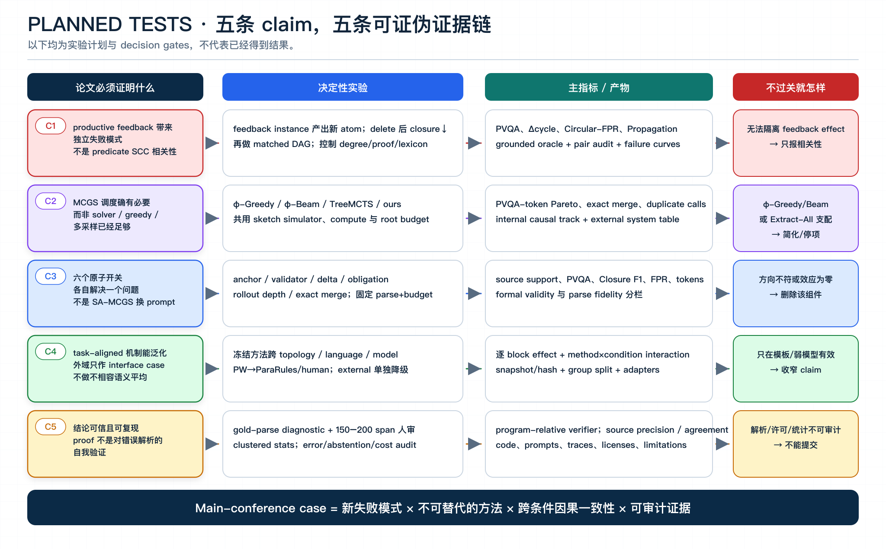
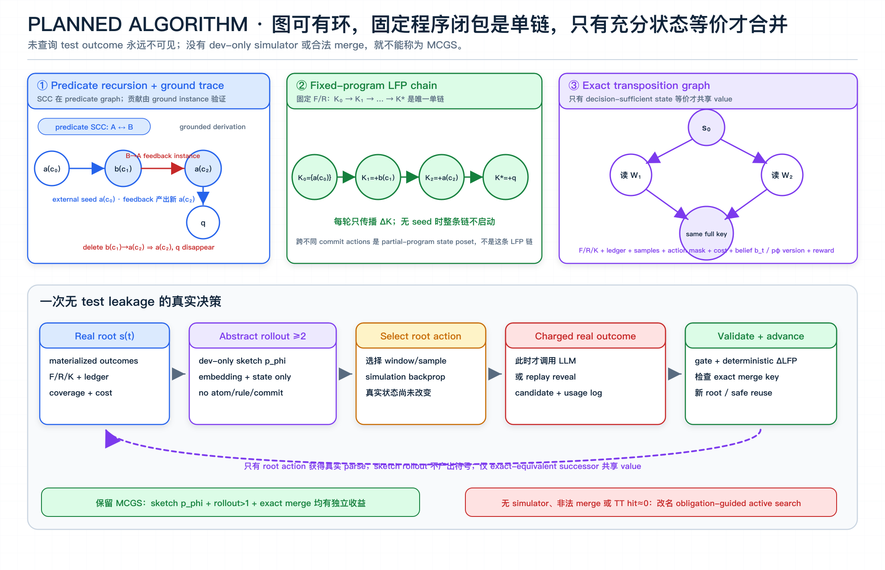
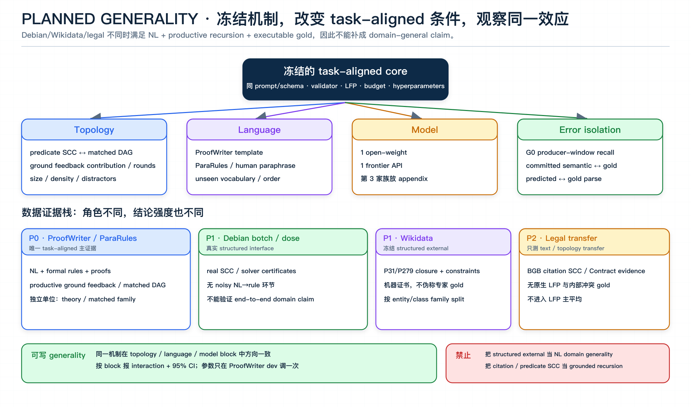
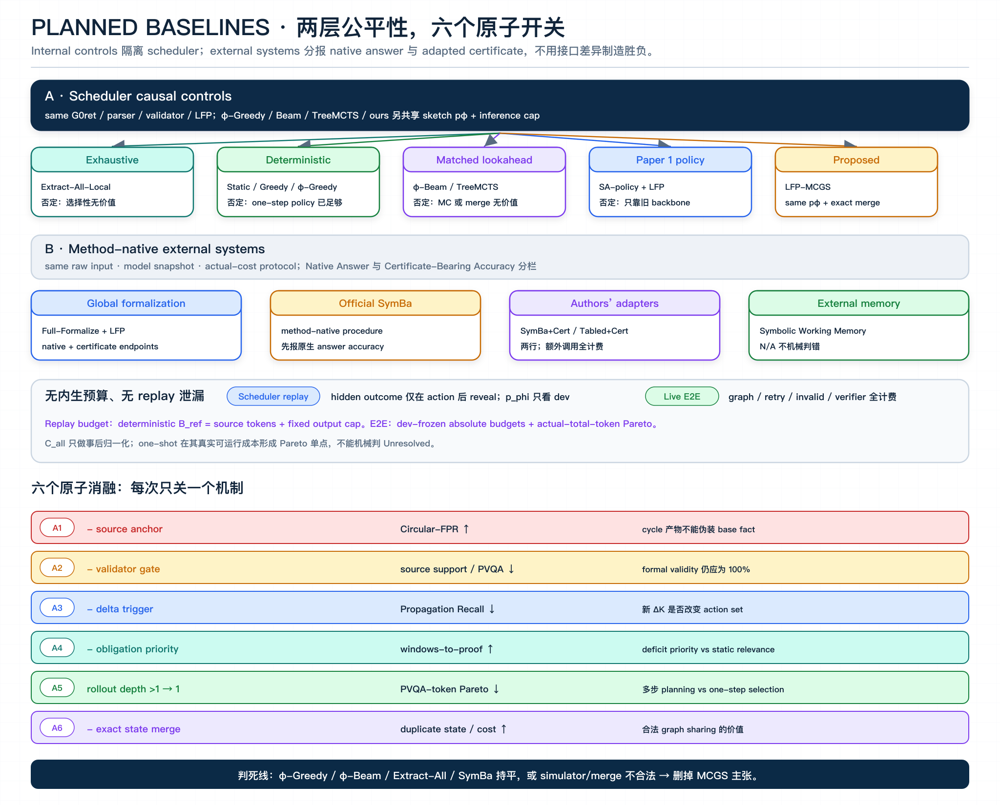

# LFP-MCGS 研究计划 V2

> 工作标题：**A Cycle Is Not a Proof: Budgeted Least-Fixed-Point Recovery over Recursive Natural-Language Rules**<br>
> 目标：2026 年 10 月 ARR；当前官方日程列出的提交日为 **2026-10-12**，最终 commitment venue 以 [ARR Dates and Venues](https://aclrollingreview.org/dates) 更新为准，现阶段不要把 “October ARR = NAACL” 写进论文。<br>
> 状态：决策版 V2.0（2026-08-16）；用于替代探索性初稿 [`LFP_MCGS_RESEARCH_PLAN_ZH.md`](./LFP_MCGS_RESEARCH_PLAN_ZH.md)。<br>
> 前提：Paper 1（SA-MCGS）已正式发表或接收；本文按独立新问题投稿。

---

## 0. 立项结论

**Conditional GO。** 这个方向有 ACL main 的故事潜力，但成败不取决于再增加多少数据，而取决于能否证明一件事：

> 在昂贵且不可靠的自然语言规则解析下，state-sharing Monte Carlo graph search 是否比 full formalization、solver-controlled backward chaining 和 deterministic obligation search 更有效地恢复 query-relevant least fixed point。

一句话故事：

> **A cycle can propagate evidence, but it cannot create evidence.**

这句话只适用于本文锁定的 **finite、function-free、positive-Horn、least-fixed-point semantics**。LLM 负责从局部原文提出候选 fact/rule；validator 决定是否提交；确定性 LFP 内核负责闭包和证明；search 只决定下一段文本读哪里。

当前最大风险不是题目太窄，而是 reviewer 认为：

> “SCC + MCGS + Datalog 是已知模块拼装；Greedy obligation search 或一次 NL→program→solver 已经足够。”

因此内部决策标准是：**先允许最强 baseline 否定项目，再决定是否扩实验。**



### 0.1 论文只承诺什么

| In scope | Out of scope |
|---|---|
| 自然语言 fact/rule 的选择性、预算受限解析 | 新的 Datalog 求值算法 |
| positive-Horn 的 query-relevant LFP recovery | negation-as-failure、ASP、时态、例外、规则删除 |
| productive recursion 与 circular self-support | 任意循环都需要循环证明 |
| 相对于 committed program 的 entailment/contradiction/unknown，以及预算不足时的 `Unresolved` | noisy parser 下的全局 soundness 或 exact completeness |
| source-linked proof relative to committed program | “LLM 解析后的 proof 等于现实语义正确” |
| ProofWriter 机制主集 + Debian/Wikidata 真实 structured interface + 法律 evidence case | 把四种不兼容语义混成一个 risk score |

### 0.2 计划中的五个 claim

| Claim | 必须给出的决定性证据 | Claim ceiling |
|---|---|---|
| C1. productive recursion 产生独立于长度/深度的 under/over-reasoning | predicate SCC 中的 grounded feedback instance 必须产生新 atom，且删除它会减少 query-relevant closure；再与 carefully matched DAG 比较 | 若无法隔离 feedback contribution / saturation-round effect，只报告相关性 |
| C2. LFP-MCGS 在预算下优于更简单方法 | 内部 controls 共用 parser/executor；`φ`-Greedy、`φ`-Beam、TreeMCTS 与 ours 还共享同一 simulator 与 compute budget；外部系统分表 | 若 Greedy/Beam/Extract-All/SymBa 支配，删掉 MCGS 主张 |
| C3. 每个新组件有可观察机制作用 | source anchor、validation、delta trigger、obligation priority、rollout、merge 的原子开关 | 无效组件直接删除，不用叙事补救 |
| C4. 收益在 task-aligned 条件变化下泛化 | 冻结超参，跨 topology、language、model 报分块 effect | Debian/Wikidata/legal 仅作 interface case，不能替代第二个 NL+recursion+gold domain |
| C5. 输出可信、统计与资产可审计 | gold-parse diagnostic、人审 source grounding、clustered statistics、完整 cost/repro bundle | 无法审计则不提交 |

---

## 1. 与 SA-MCGS 的关系

Paper 1 是静态风险证据搜索；Paper 2 是预算受限的递归程序恢复与固定点证明。SCC、局部窗口、UCB、virtual loss 和 transposition 的思想可以继承，但不能再次声称为新贡献。

| 维度 | Paper 1：SA-MCGS | Paper 2：LFP-MCGS |
|---|---|---|
| 科学问题 | 循环文档中风险证据在哪里 | 递归规则中哪些结论有 grounded support，相关闭包是否恢复完整 |
| 状态 | node/edge risk statistics、critical-pair evidence、dynamic risk core | candidate ledger、committed program、LFP closure、provenance、proof obligations |
| LLM 角色 | 局部风险评价与关系抽取 | 局部 NL→candidate fact/rule；不决定逻辑真值 |
| 确定性内核 | 无 exact semantic executor | incremental semi-naive LFP + proof verifier |
| 重访触发 | critical pair / cadence | `ΔK` 与 missing premises 唤醒 producer windows |
| 输出 | compact risk subgraph | answer + query-relevant closure + source-linked certificate |
| 停止 | rollout budget | program-relative proof / unknown；覆盖或解析不足则 `Unresolved` |
| 数据 | 以注入风险为主 | 原生 ProofWriter recursion、真实 Debian certificates、冻结外测 |

**Paper 2 的独立贡献必须落在：**新任务、形式语义、新 state/transition、LFP invariant、proof/coverage stopping、新数据切片和新评价。Paper 1 的 OC、relation-first memory、risk prompt、dynamic risk core 与 repair nodes 不迁移为本文贡献。

若 Paper 1 已发表，双盲稿按第三人称正常引用并给出清晰 difference table；不写 “our previous work”，不复用原文、图和表。ACL 当前 publication ethics 要求披露并明确区分相关先前工作，同时限制文本复用；提交前按最新 [ACL Publication Ethics Policy](https://www.aclweb.org/adminwiki/index.php/ACL_Policy_on_Publication_Ethics) 和 [ARR author checklist](https://aclrollingreview.org/authorchecklist) 再审计。

---

## 2. 方法：必须先证明它真的是 MCGS

### 2.1 语义内核

给定已验证 base facts `F̂` 和 positive-Horn rules `R̂`：

\[
K_0=\hat F,\qquad K_{i+1}=K_i\cup T_{\hat R}(K_i),\qquad K^*=\operatorname{lfp}_{\hat R}(\hat F).
\]

单次查询状态至少包含：

- `L_t`：mutable candidate ledger；保留 source span、置信度、重复支持和 reject/retry 记录；
- `F̂_t, R̂_t`：已通过 gate 的 committed program，单调增长；
- `K_t`：当前 exact LFP closure；
- `Π_t`：每个派生 fact 的 proof pointer；
- `O_t`：missing-premise / producer obligations；
- `C_t`：已覆盖 window/record；
- `Z_t`：search statistics 与 remaining budget。

核心职责必须保持分离：

```text
LLM proposes → validator commits → deterministic LFP derives
             → obligations change → search decides the next read
```

Validator 能检查 span、schema、binding、方向和多次支持，但不能“确定性证明自然语言语义正确”。所有 soundness 只相对于 committed program；端到端可信度由 gold-parse 对照和人工局部解析审计补充。

输出状态始终带有 **program-relative** 限定：`PR-Entailed`；显式 complement 可证时的 `PR-Contradicted`；当前 committed program 饱和且覆盖协议完成时的 `PR-Unknown`；以及预算或覆盖不足时的 `Unresolved`。只有 gold-parse/oracle track 才能把前三者称为对 gold program 的 certified 结论；end-to-end track 不能排除 parser false negative 或 validator false reject。

### 2.2 三张图与真实 MCGS 定义



必须区分：

1. **Predicate dependency graph + grounded derivation hypergraph**：recursive SCC 定义在 predicate graph；productive contribution 由 grounded rule instance 证明——该 feedback instance 必须产生此前未知 atom，且删除它会减少 query-relevant closure 或改变 query label；
2. **Fixed-program LFP chain**：固定 committed program 后 `K₀→K₁→…→K*` 是唯一单调链；跨 action 的对象是 monotone partial-program state poset，不应误称同一个 closure lattice；
3. **MCGS transposition graph**：不同读取顺序只有在完整 decision-sufficient state 等价时才能共享 search value。

另有一个非语义输入图 `G₀^ret`：node 是 text window，edge 只表示 explicit reference、entity/term overlap 或 retrieval-neighbor。它只定义可选 action 与 producer-window 候选，**不能**被当作 predicate SCC 或 formal dependency graph。

为了让 `MCGS` 名称成立，算法必须明确定义：

| 元素 | 定义 |
|---|---|
| Environment state | 已 materialize 的真实 parse outcomes、committed program、exact closure/provenance、ledger、obligations、coverage 与 remaining budget |
| Action | 选择下一 window，以及是否追加 parse sample / verification |
| Real transition | 只在 root action 被执行时调用 LLM，或由 replay environment 揭示一个此前不可见的 frozen outcome；每次都计入 action/cost ledger |
| Simulation model | `p_φ(y | b_t,w)` 是 dev-frozen 的低成本 **outcome-sketch model**；输入仅含 `G₀^ret` 结构、一次性冻结的 retrieval embedding、已 materialize 统计和当前 obligation projection；不读取 hidden parse/gold，不生成 atom、rule 或 span |
| Rollout | `p_φ` 只推进 abstract belief state `b_t`：valid-yield、`|ΔK|` bin、可能关闭/激活的 producer region、query-progress 与 cost；至少两步 lookahead，但不修改真实 `F/R/K`、不产生 proof、不能触发 semantic terminal |
| Root advance | 执行选定 root action，取得真实 outcome，经 gate 与 `ΔLFP` 形成真实 successor，再复用合法 subtree |
| Exact merge key | committed `F/R/K`、candidate sufficient statistics、per-window sample counts、coverage/action mask、remaining-cost state、abstract belief `b_t`、`p_φ` version，以及 reward 所需 provenance summary |
| Merge safety | 只有上述 key 满足同 action set 与同 transition/reward distribution，才共享 visit/value；否则只共享 static parse cache 或 `ΔLFP` memo，不共享 search statistics |
| Value | real successor 用 program-relative `ΔK`、closed obligations、query proof、coverage，减 invalid/duplicate/token cost；simulated successor 只用 sketch 的 expected progress/cost，不给 proof terminal reward |
| Terminal | 只由 real exact state 判定 PR-entailment/contradiction/unknown 或 `Unresolved`；abstract rollout 不能自行终止为语义结论 |

`p_φ` 的设计是本项目能否保留 MCGS 名称的硬约束：

- **输入：**`G₀^ret` degree/distance/reference type、预先计费的 fixed retrieval embedding、已查询 window 的 aggregate parse yield、当前 obligation-to-window projection、coverage 与 remaining budget；simulation 时不再读取 raw window tokens；
- **输出：**离散 `OutcomeSketch = (p_valid, ΔK-bin, closed/opened-region IDs, query-progress-bin, cost-bin)`；它没有 symbolic decoder，任何输出都不能进入 ledger 或 certificate；
- **训练：**只使用 train/dev action logs；架构、feature set、binning 与 training budget 在 test 前冻结。若按 local-parser snapshot 做校准，使用同一预注册配方并报告为 procedure-level generalization；另做 shared-`p_φ` zero-shot sensitivity；
- **成本：**embedding、训练 GPU time、每次 simulator inference 和 simulator-call count 全部报告；`φ`-Greedy、`φ`-Beam/BestFirst、TreeMCTS 与 LFP-MCGS 获得完全相同的 `p_φ` 访问权和 inference budget；
- **越界处理：**若实现最终让 `p_φ` 读取完整 raw text 并生成 candidate program，它就属于另一个 parser，必须加入 `Extract-All-pφ` / cascade baseline，并把全部调用计入成本；否则不能把收益归因于 Monte Carlo planning。

**命名门槛：**如果没有独立、dev-frozen 且无 test leakage 的 transition/value model，最终只是每轮单步 argmax/UCB，或 exact transposition hit 接近 0、去 merge 无影响，则方法应诚实改名为 `obligation-guided active graph search`。不能让标题比算法更复杂。

### 2.3 最小运行过程

```text
1. 由 explicit references、entity/term index 与 dev-tuned lexical/embedding retrieval 构造高召回 `G₀^ret`；不使用 gold predicate/rule。
2. `G₀^ret` 只做 producer-window retrieval / action slicing；报告 relevant producer-window recall、构建 tokens/CPU 与遗漏，不在其上声称 semantic SCC。
3. 初始化 committed program；incremental LFP 得到 `K₀` 与 proof frontier；每次 commit 后更新 partial predicate dependency graph，并仅在已提交规则上动态运行 Tarjan。
4. MCGS 只用已 materialize outcomes + dev-frozen sketch `p_φ` 推进 abstract `b_t`，做无泄漏多步 simulations，选择 root action。
5. 执行 root action：Local LLM 输出 candidate facts/rules + spans；replay track 此时才揭示 frozen outcome；全部计费。
6. Validation gate 决定 reject / retain / commit；candidate 不能直接进入 K。
7. Incremental LFP fire 已满足的 committed rule，产生 ΔK/proof；更新 obligations 与真实 environment state。
8. 检查 exact merge key 后前移 root/复用 subtree；不满足 bisimulation 就不共享 value。
9. 有 program-relative proof 则返回 PR-Entailed/Contradicted；覆盖协议完成且当前程序饱和才返回 PR-Unknown；否则继续或 Unresolved。
```

`G₀^ret` 是所有 scheduler controls 共用的可观测输入。主表使用 predicted retrieval graph；gold predicate graph / grounded derivation 只作 diagnostic。必须分别报告 `G₀^ret` 的 relevant producer-window recall，以及 committed predicate graph 相对 gold 的 semantic edge error。若构建 `G₀^ret` 需要 LLM，其全部调用计入 end-to-end cost；若 predicted-input E2E 崩溃，论文只能保留 oracle-structure diagnostic claim。

### 2.4 必须单测的不变量

- `F̂_t ⊆ F̂_{t+1}`、`R̂_t ⊆ R̂_{t+1}`、`K_t ⊆ K_{t+1}`；
- 每次更新后 `K_t = lfp_{R̂_t}(F̂_t)`；
- 每个 `a ∈ K_t` 都有最终落到输入事实 span 的有限 proof；
- 无 seed 的 `a→b, b→a` 不推出 `a` 或 `b`；
- finite positive program 必然终止；
- 预算耗尽但 relevant sources 未覆盖时只能返回 `Unresolved`；
- static parser 尽量不读 `K_t`；若 prompt 读取 state，cache key 必须包含 projected state。
- 未查询的 frozen replay outcome 对 policy/simulator 不可见；
- simulator 不能输出或提交 symbolic fact/rule，且每次 inference 有独立 cost record；
- 共享 visit/value 的任意两个 state 必须通过 action-set、transition 与 reward 的等价性测试。

---

## 3. Generality：三个 task-aligned 变化轴，外域证据单独降级

本文对 generality 的定义：

> **同一 interface、核心机制和冻结超参数，在受控分布变化下仍产生方向一致的机制收益。**



### 3.1 数据角色

| 数据 | 已核实资产 | 论文角色 | 允许的结论 |
|---|---|---|---|
| [ProofWriter OWA D5](https://allenai.org/data/proofwriter) | 4,752 theories / 100,030 queries；predicate-level 初筛中 2,792 strict-positive theories 含 SCC | 核心机制主集 | 最终结论必须基于 grounded productive subset，而不是 predicate SCC 计数 |
| ProofWriter ParaRules | 2,403 theories / 40,022 queries；predicate-level 初筛中 1,777 theories 含 SCC | human-paraphrased language shift | task-aligned language generalization；不是现实业务数据 |
| [Debian snapshot](https://snapshot.debian.org/) + botch/dose | botch build graph 5,367 cyclic vertices；真实 missing dependencies / feedback arcs；dose 有天然 failure explanations | 真实 structured interface case | grounded buildability 与 constraint certificates **分表**；不能验证 noisy NL parsing claim |
| Frozen Wikidata | P31/P279 closure、disjointness machine certificates | structured external | closure/interface transfer；不伪称专家确认冲突 |
| BGB / ContractNLI / CUAD | 真实法律文本与 evidence；无原生 LFP/internal-conflict gold | 小规模 transfer/case study | source grounding / topology transfer；不进 LFP 主平均 |

完整下载、SCC、许可证与哈希见 [`LFP_MCGS_DATASET_AUDIT.md`](./LFP_MCGS_DATASET_AUDIT.md)。

### 3.2 主集与受控诊断必须分开

**Native main：**

- 先在 gold predicate dependency graph 上找 recursive SCC，再在 **grounded rule-instance derivation** 上验证贡献；predicate SCC 只是必要条件，不是正例标签；
- `PW-Productive-Core`：外部 seed 进入 query-relevant recursive predicate SCC；gold trace 中至少一个 feedback-edge instance 产生此前未知的 ground atom；删除该 instance/rule 后，query-relevant closure 严格缩小或 query label 改变；
- `PW-Productive-Deep`：提高 minimum saturation rounds；各轮新增 atom 必须位于 query ancestor cone，不能由无关 acyclic tail 凑轮数；
- `PW-Native-Recursive`：满足上述条件的官方原生 examples；当前 2,792 / 1,777 只是 candidate pool，最终样本数要以 grounded audit 为准。

**Controlled diagnostic：**

- productive seed ↔ decoy/unseeded；
- SCC ↔ DAG 的成对改写须保持 rule/fact 数、fan-in/out、proof depth/multiplicity、entity/predicate frequency、label balance 与 surface length，只改变经 oracle 验证的 recursive feedback structure；
- 每个 SCC case 另做 feedback-instance deletion counterfactual；若删除后 closure/query 不变，该 case 只能进 inactive control，不能进 productive 主集；
- fixed-point rounds、SCC size、density、distractor ratio；
- context packing 只作为透明的 long-context stress，不能伪称原生长文档。

有限 Datalog entailment 总能展开成 DAG proof，所以论文不能声称“query 必须循环证明”。可检验的变量是 **predicate-recursive feedback 的 grounded counterfactual contribution 与 saturation rounds**。如果无法构造保持上述混杂因素的 matched pair，就把 cycle-specific causal claim 降为结构相关性。不能把 controlled counterfactual 写成“天然风险”；如果收益只来自人工 packing，而 native ProofWriter / ParaRules 没有收益，主会方法故事不成立。

### 3.3 三个主泛化轴 + 一个 interface transfer 轴

| 轴 | 变化 | 冻结项 |
|---|---|---|
| Topology | SCC↔DAG、rounds、size、density、distractors | parser、scheduler weights、budget ratio |
| Language | template→ParaRules→小规模 human paraphrase；unseen vocabulary/order | formal oracle、split family、prompt schema |
| Model | 至少 1 个可复现 open-weight + 1 个 frontier API；第 3 家族 appendix | exact snapshot、decoding、retry policy |
| External interface（不计入 core generality） | Debian closure/certificate、frozen Wikidata、legal evidence | common evidence interface；method-native utility 分开，不宣称 end-to-end domain generalization |

`G₀^ret` producer recall、committed semantic graph vs gold predicate/grounded graph、gold parse vs predicted parse 是错误隔离轴，不应被包装成额外“领域”。所有 scheduler 参数只在 ProofWriter dev 调一次；外域不重新调参。若提交前找不到第二个同时具备 **自然语言 + native productive recursion + executable gold** 的 corpus，C4 只能写 topology/language/model generalization；Debian、Wikidata 与法律实验只称 interface case study。

Human paraphrase 必须在任何 test model 运行前盲建；由独立 annotator 与 symbolic oracle 双重验证 logical equivalence，并按 theory/paraphrase family 切分。ParaRules 与这批 paraphrase 都属于 ProofWriter family，因此正文只能写 **cross-condition / cross-language-realization generalization**，不能写独立 domain generalization。

---

## 4. Baseline：先解决 Paper 1 的公平性问题

Paper 1 reviewer 最核心的担忧是：baseline 承担 full-SCC 长输出，而 proposed 使用 local schema + algorithmic assembly。Paper 2 必须拆成两种公平性：

- **A. Scheduler causal controls：**Extract-All、Static、Greedy、`φ`-Greedy、`φ`-Beam、TreeMCTS、SA-policy 与 LFP-MCGS 共享完全相同的 `G₀^ret`、local parser、window、schema、validator、LFP、cache 和 proof assembler；其中 simulator-family 四种方法再共享同一 outcome-sketch simulator、simulator-call/compute budget；
- **B. External systems：**Full-Formalize、official SymBa、Symbolic Working Memory 保留 method-native prompt/controller。统一 raw input、model snapshot、actual-cost protocol 与 invalid policy，但不能虚假声称它们共享 local schema 或原生 certificate format。



### 4.1 最低合格 baseline ladder

| 优先级 | Baseline | Task-aligned 实现 | 它否定的捷径解释 |
|---|---|---|---|
| Oracle | Gold-SN / Magic | gold program→独立 semi-naive/Soufflé；Magic Sets 做 query-directed exact ceiling | “你重新发明了 Datalog/SCC” |
| P0 | Full-Formalize+LFP | 全文一次 NL→program，solver-error repair，同一 LFP | “一次 formalize + solver 已解决” |
| P0 | Extract-All-Local+LFP | 每个相同 window 读一次，再用同一 validator/LFP 组装 | 消掉 decomposition/schema confound |
| P0 | Greedy-Obligation+LFP | 使用同一 `Rel+Deficit+Unseen`，每轮 argmax；无 rollout/backprop/merge | **最危险：obligation heuristic 已足够** |
| P0 | `φ`-Greedy+LFP | 同一个 sketch `p_φ`，每轮选 one-step expected utility 最大 action | “收益来自 learned model，不来自 lookahead” |
| P0 | `φ`-Beam/BestFirst+LFP | 同 `p_φ`、action、simulation-call/compute budget 的 deterministic multi-step search | “deterministic lookahead 已足够” |
| P0 | TreeMCTS-LFP | 同 `p_φ`、action/reward/LFP，但等价真实 state 不合并；仍共享 parser cache | “Monte Carlo 有用，但 state merge 没价值” |
| P0 | LFP-MCGS | 完整方法 | — |
| External | [official SymBa](https://aclanthology.org/2025.naacl-long.124/) | 按论文/官方流程复现，先报 method-native answer accuracy | “已有 selective symbolic controller 已解决 label task” |
| External | **our SymBa+Cert adapter** | 在 official controller 后增加可审计 proof extraction；额外调用全部计费 | “证书差异只是输出接口” |
| External | **our Tabled-SymBa+Cert** | 在上述 adapter 上加入 cycle-safe tabling；与 official/Cert 两行同时报告 | “已有 controller 加最小 cycle fix 已解决” |
| P1 | [Symbolic Working Memory](https://aclanthology.org/2024.emnlp-main.974/) | official-style symbolic grounding + LLM rule implementation | “临时 symbolic memory 已经足够” |
| P1 | Static-SCC-Demand+LFP | query backward slice→condensation topological order→SCC round-robin | “Tarjan + deterministic traversal 已足够” |
| P1 | SA-policy+LFP | SA-MCGS structural/coverage policy + 同一新 executor | “收益只是继承 Paper 1 policy 或只来自 LFP” |
| Sanity | Full-context answer / verifier-guided BoN | 同 token 预算重复 full-context sampling，取首个 valid proof | “只要多采样即可” |

[Logic-LM](https://aclanthology.org/2023.findings-emnlp.248/) / [LINC](https://aclanthology.org/2023.emnlp-main.313/) 定义 global neuro-symbolic 范式；[Symbolic Working Memory](https://aclanthology.org/2024.emnlp-main.974/) 和尤其 [SymBa](https://aclanthology.org/2025.naacl-long.124/) 是最接近的外部方法。普通 Direct/CoT、random、BM25/k-hop、Bi-Chainer 可作为诊断或 appendix，不能承担 headline comparison。

External systems 分两种 endpoint、分表呈现：

1. **Native Answer Accuracy：**只按各方法原生 label/answer 计分，不因缺少本文 certificate schema 被机械判错；
2. **Certificate-Bearing Accuracy：**通过公开、可逆的 adapter 输出统一 source-linked certificate；所有 extraction/repair 调用计费。无法映射时记 `N/A`，不把接口不兼容伪装成方法错误。

只有内部 scheduler controls 能承担 MCGS 机制的因果主比较；external table 回答 system-level competitiveness。Official SymBa、our SymBa+Cert 与 our Tabled-SymBa+Cert 必须是三行，不能只展示作者适配版。

Exact evaluator 不混入 end-to-end accuracy：单独做 `naive recompute / incremental semi-naive / SCC-wise / Soufflé` 微基准，先验证 closure 完全一致，再报告 CPU、rule firings 与 memory。

### 4.2 双轨公平协议

**Track A：scheduler-only causal replay**

- 对每个 `(instance, window, model snapshot)` 冻结一组 local parse outcomes，但 test policy 与 `p_φ` 在 action 执行前都不可见；
- action 执行后，environment 才揭示该 window 的下一个 outcome；所有 scheduler controls 使用同一 reveal order、validator 和 LFP；
- `p_φ` 只能用 train/dev outcome 训练，且只输出 abstract sketch；必须有 hidden-outcome 与 no-symbolic-output unit tests；
- `φ`-Greedy、`φ`-Beam、TreeMCTS 与 LFP-MCGS 使用同一个 frozen `p_φ`、相同 simulator inference cap 和相同真实 root-action budget；
- 先按 deterministic unique-window / source-token allowance 对齐，再审计实际 token；
- 另跑 gold-window reveal，隔离 parsing error；
- 允许多 seed 廉价复跑，严格测 scheduler / merge，而不是 API 波动。

**Track B：live end-to-end**

- 所有模型调用、repeated source tokens、invalid、retry/repair、validator LLM、proof generation、graph/embedding construction全部计费；
- symbolic solver 的 CPU/RAM/wall time单列，不称免费；
- 所有方法使用相同并发；并发只影响 wall time，不改变 token 账；
- `invalid` 与 `Unresolved` 在主 accuracy 中计错，同时另报 selective accuracy–coverage。

Scheduler-only 使用 test 前即可计算的 reference allowance：

\[
B_{ref}(i)=\sum_{w\in W_i}\text{source tokens}(w)+|W_i|\cdot\text{fixed output cap}.
\]

`B_ref` 不依赖某次 Extract-All 的随机 output/retry。Scheduler replay 可用 `b ∈ {0.10, 0.25, 0.50, 1.00} × B_ref(i)`。Live end-to-end 的主结论使用 **actual total-cost Pareto** 与由 dev 预先冻结的共同绝对 token budgets；事后记录的 `C_all(i)`（Extract-All 的实际总成本）只作效率归一化，不决定 test budget。one-shot 方法在其真实可运行成本处形成 Pareto 单点，不能通过给它一个机械不可运行的低预算点制造优势。

---

## 5. 主实验包

### 5.1 预注册主指标

**Primary endpoint：dev 预先冻结的共同 absolute token budget `B*` 下的 Proof-Verified Query Accuracy（PVQA）。**

PVQA 要求 label 正确；`PR-Entailed/Contradicted` 必须附 formal-verifier-valid proof；`PR-Unknown` 必须满足预注册 coverage protocol；Invalid 与 Unresolved 记 0。它仍是相对于 committed program 的端到端结果，不把 proof validity误写成 parser soundness。

PVQA 是内部 scheduler track 的 confirmatory endpoint。External systems 另报 method-native Answer Accuracy 与加 adapter 后的 Certificate-Bearing Accuracy；不能因原方法没有本文 proof schema 而在 PVQA 中机械记错。

cycle-specific 主检验是预注册的 paired interaction，而不是只看 SCC 子集绝对分数：

\[
\Delta_{cycle}=\bigl(PVQA_{ours}^{SCC}-PVQA_{base}^{SCC}\bigr)
-\bigl(PVQA_{ours}^{DAG}-PVQA_{base}^{DAG}\bigr).
\]

PCCA 降为 robustness metric：matched group 固定成员数，只有全组正确且正例 proof valid 才记 1；同时单独报告 productive/inactive 两侧，避免 all-or-nothing 掩盖错误来源。

Secondary metrics：

- query-relevant Closure Precision / Recall / F1；
- Circular-Support FPR；
- Grounded-Propagation Recall；
- source-grounding / provenance validity；
- irrelevant-fact rate；
- calls/tokens/time-to-first-valid-proof；
- unique windows、duplicate states/calls、TT merge/hit rate；
- `Δ_cycle`、method×cycle / method×model interaction；
- selective accuracy–coverage；
- 分域 utility：Debian root cause/buildability、Wikidata constraint certificate、legal evidence recall。

### 5.2 六组实验

| 实验 | 问题 | 设置 | 主输出 |
|---|---|---|---|
| E0 Oracle sanity | 数据与 LFP 实现是否正确 | gold program；四种 exact evaluators | closure equality、runtime、unit tests |
| E1 Failure isolation | productive feedback 是否带来独立失败 | predicate-recursive SCC + grounded contribution/deletion oracle + carefully matched DAG | `Δ_cycle`、FPR、Propagation-vs-rounds |
| E2 Main scheduler | MCGS 是否必要 | P0 internal controls，尤其 `φ`-Greedy/Beam/TreeMCTS × frozen budgets × 2 models | PVQA/token 与 Closure-F1/token Pareto |
| E3 Mechanism | 哪个组件解决哪个 failure | 六个原子开关 + `validation × delta` 2×2 | paired effect + 95% CI |
| E4 Generality | 效应是否跨条件 | ParaRules/human paraphrase、topology OOD、models | 逐 block effect，不做 pooled semantics |
| E5 External interface | executor/scheduler interface 能否迁移 | Debian；frozen Wikidata；legal evidence case | 分域 utility；不作为 NL end-to-end generality 证据 |

### 5.3 结果必须这样呈现

**Main paper figures：**

1. productive vs inactive SCC 的 matched causal setup；
2. method architecture，明确三张图；
3. 三联结果图：`PVQA–actual-tokens Pareto / closure vs fixed-point rounds / Circular-FPR vs Propagation Recall`。

**Main paper tables：**

1. 数据与 semantic profile；
2. 最强 baseline 主结果，按 model/domain 分块；
3. 六个原子消融；
4. generalization 与 error decomposition，可视版面放 appendix。

不要做一个十几方法、四领域、三模型的巨大平均表。它会掩盖语义差异与模型异质性。

---

## 6. 关键消融与补充实验

### 6.1 六个原子开关

| Ablation | 唯一目标指标 | 预期因果结论 |
|---|---|---|
| `– source anchor` | Circular-FPR↑、unsupported fact rate↑ | 不允许 rule/cycle 产物伪装成 base fact |
| `– validator gate`，schema-valid 首次 parse 立即 commit | source-support precision↓、parse fidelity↓、PVQA↓ | repeated/source-grounded validation 抑制解析污染；formal proof validity relative to committed program 仍应为 100% |
| `– delta trigger`，`ΔK` 不改变 producer action set | Propagation Recall↓、Closure F1-vs-rounds 变陡 | 新事实本身是否触发 productive revisit |
| `– obligation priority`，保留动态 action set 但去掉 deficit score | windows-to-proof↑、irrelevant-fact rate↑ | missing-premise priority 是否优于静态相关性 |
| rollout depth `>1 → 1` 且关闭 backprop | PVQA-token Pareto↓ | 多步 Monte Carlo planning 是否优于 one-step active selection |
| `– exact state merging` → TreeMCTS | duplicate states/tokens↑；PVQA Pareto↓ | 满足等价条件的 graph-state sharing 是否有价值 |

补一个 `validator gate × delta trigger` 的 2×2 factorial，直接展示两个正交目标：**抑制错误提交**与**促进传播**。所有消融固定 action set 定义、模型、parse outcomes 与预算；不能把多个开关绑成一个名字。

### 6.2 必做但放 appendix / diagnostic

- deterministic LFP → LLM-only working memory：验证 no-circular-bootstrap；
- gold local parse vs predicted parse：定位 parsing / search 瓶颈；
- gold structure vs predicted graph：分离 graph-construction error；
- no SCC slicing、random/source-order、query slicing；
- window size、UCB/rollout depth、commit threshold、budget sensitivity；
- three search seeds；不同 model 单独报告；
- no-op/paraphrase/rule-order/distractor robustness；
- one-query full cost 与 multi-query cache amortization 分开。

Paper 1 reviewer 已经指出 prior coefficients、模型非一致收益和输出 cleanliness。本文从一开始就报告 sensitivity、逐模型 effect、closure precision/irrelevant-fact rate，而不是 rebuttal 阶段补。

---

## 7. 统计、人工审计与错误分析

### 7.1 统计单位

- ProofWriter：`theory / matched group` 是独立单位，不能把同 theory 的多个 query 当 IID；
- Debian：按 source family / explanation root-cause cluster；525 行 failure 不能当 525 个独立例；
- Wikidata：按 entity/class family；
- stochastic search：至少 3 seeds；`temperature=0` 也不声称完全确定。

Track A 与 Track B 不能套用同一个重复测量模型：

- **Scheduler replay：**层次是 `matched family/theory → query → frozen parser outcome → search seed → method × budget`。同一 outcome/reveal order 与 seed 内先配对 method，再聚合到 query 与 outer family；hierarchical paired bootstrap 重采 outer family，并在内部重采 outcome/seed；
- **Live end-to-end：**不同方法会自适应地产生不同 window、calls 与 outcomes，不能按“相同 parser outcome”配对。以 theory/family 为 outer cluster，以独立 live run 为内层重复；只在相同 theory/model/budget 上配对 method，再做 clustered bootstrap 或 mixed model。

预注册一个 confirmatory model snapshot（优先可审计的 open-weight model）。Primary family 是该模型在 `B*` 上 `ours vs Extract-All / Greedy / φ-Greedy / φ-Beam / TreeMCTS` 的 PVQA 与 `Δ_cycle`，共 10 个 contrasts，做 Holm correction；第二模型是预注册 replication family，单独报告 effect/CI，不与第一模型池化。External-system accuracy/certificate comparisons 单列 secondary family。Binary paired outcome 可补 exact McNemar/sign test；mixed-effects logistic model（random intercept: theory/family；fixed interaction: method×cycle、method×model）作 robustness analysis。Token/time 报 median、IQR 与 paired CI。不同 model/domain 分块报告，不用 pooled 数字遮住反向效果。

昂贵 LLM 方法可跑预先冻结的分层 test subset，但所有方法必须是同一 subset。先用 pilot 方差做 paired power analysis；样本量、`B*`、GO effect threshold 与 primary contrasts 都在 dev 阶段写入 signed manifest，不能看 test 后调整。最低要求是覆盖足够多的独立 theory/root-cause groups，而不是追求 query 行数。

### 7.2 150–200 个局部解析的人审

两位不知道方法名称的标注者，分层检查：

1. graph construction；
2. predicate、binding、polarity 与 rule direction；
3. source span 是否真正支持 formalization；
4. validation false accept/reject；
5. scheduler 是否漏读必要 window；
6. closure/provenance implementation；
7. `Unknown / Unresolved` termination；
8. invalid API/schema output。

报告 instructions、抽样方法、分母、κ/α、adjudication；若使用外部标注者，按最新 checklist 报招募、报酬、consent 和 IRB/exemption。展示三条完整 trace：成功、under-reasoning、circular self-support。

### 7.3 Contamination 与自然性

ProofWriter 是常用 benchmark，frontier model 可能见过。必须加入：

- topology-family OOD；
- unseen paraphrase/vocabulary；
- ParaRules 与小规模新 human paraphrase；
- official native subset 与 controlled stress 分表；
- 至少一个 open-weight model；Debian/Wikidata 只提供真实 structured interface case，不用于补足 task-aligned domain generalization。

主表不再依赖 AIGC 生成风险。受控 seed/DAG counterfactual 只回答机制问题；Debian/Wikidata 回答现实 interface utility，两者不能互相冒充。若找到第二个 NL+productive-recursion+executable-gold corpus，必须重新做许可证/语义审计后才升级为 domain-generalization 证据。

---

## 8. AC/SAC 视角下的必过门槛

ARR 当前 review 关注 soundness、excitement 与 overall；Findings 与 main 都要求 sound/reproducible，main 还要求在 novelty、impact 或其他方面足够 distinguished。[ARR Reviewer Guidelines](https://aclrollingreview.org/reviewerguidelines)、[ARR AC Guidelines](https://aclrollingreview.org/acguidelines)

### 8.1 最可能的 meta-review

若现在直接投稿，最可能的结论是：

> 问题有趣，但尚未证明 Monte Carlo graph search 比 deterministic proof-obligation scheduling 必要；跨域实验又混合不兼容语义，因此 novelty 与 empirical support 不足。

把它变成 main-conference case，需要同时闭合：

- **Soundness：**形式范围、exact verifier、strong/fair baselines、clustered statistics、gold/predicted error separation；
- **Excitement：**明确识别 productive recursion vs circular self-support 这一受控 NLP failure；
- **Novelty：**state-sharing multi-step search 不能被 SymBa、Greedy 或 full formalization 替代；
- **Impact：**在更少解析预算下返回 source-linked certificate，task-aligned shifts 保留效应，并诚实展示真实 structured interface utility；
- **Reproducibility：**数据索引、快照、哈希、prompt、trace、成本与代码完整。

### 8.2 Go / No-Go

**GO：**

- productive-feedback/matched-DAG 与 blind-built human paraphrase 上至少两个模型存在 recursion-specific interaction；dev-frozen minimum effect 与 paired CI 门槛在 test 前锁定；
- 在共同预算 `B*`，LFP-MCGS 的 PVQA / `Δ_cycle` 优于最强 deterministic baseline，尤其是共享 `p_φ` 的 `φ`-Beam/BestFirst；或 accuracy 实质等价但 actual tokens 明显更低；
- exact state merge 与 rollout depth>1 分别产生 dev 预注册的最小准确率或成本效应，且 CI 不跨 0；
- source anchor、validator、delta trigger 与 obligation priority 在各自指标上方向正确；
- ParaRules/human paraphrase 保持主要效应；Debian/Wikidata 只需完成诚实、分语义的 interface evaluation；
- formal verifier 对输出 certificate 的 program-relative validity 为 100%；source-grounding 人审 precision 目标 `≥90%`，κ/α 目标 `≥0.7`。

数值门槛由 pilot variance / power 在 dev manifest 中确定；不能看 test 后把经验点数改成 success criterion。

**NO-GO / 简化：**

- Full-Formalize 或 Extract-All 支配整个 Pareto frontier；
- Greedy-Obligation 与 LFP-MCGS 差异很小且更便宜；
- `φ`-Greedy 或 `φ`-Beam/BestFirst 在相同 simulator/root-action budget 下持平或更好；
- Tabled-SymBa 同成本恢复同等 closure/proof；
- TreeMCTS 持平且 TT merge/hit 很低；
- 无法实现不读取 hidden test outcomes 的 transition/value model，却仍依赖“多步 rollout”叙事；
- full decision-sufficient key 使可合法 merge 的 state 几乎不存在；
- strong model 没有 recursion failure，收益只存在于单一弱模型；
- 增益只来自 packing、invalid output 或 oracle graph；
- 把 structured external 或 legal evidence 偷换成 end-to-end NL-LFP generalization；
- 数据许可或 snapshot 使结果无法复现。

若只剩 deterministic obligation scheduler 有效，可以改成更简单、更诚实的 symbolic reasoning 论文；不要为了保留 `MCGS` 名称继续加组件。

---

## 9. 八周执行计划

| 周 | 只做这些事 | 交付 / Gate |
|---|---|---|
| W1 | symbolic IR、predicate/grounded contribution audit、cheap `G₀^ret` builder、exact LFP/proof verifier | productive subset + feedback-deletion oracle + producer-window recall；retrieval SCC 不进主集 |
| W2 | Full-Formalize、Extract-All、Greedy；hidden-outcome replay；240-case pilot | **Gate A：**问题存在、`G₀^ret` 可用、简单 baseline 未直接解决；冻结 `B*`/contrasts |
| W3 | dev-only sketch `p_φ`、`φ`-Greedy/Beam、genuine root advance、ledger/obligations、exact merge key | no-symbol/no-leak tests；simulator calibration/cost；real vs abstract transition trace |
| W4 | LFP-MCGS、TreeMCTS、official SymBa + two explicit adapters；六个原子开关 | **Gate B：**Greedy/Beam/SymBa/TreeMCTS 未否定 MCGS；否则改名/简化/停项 |
| W5 | ProofWriter/ParaRules 主运行；2 models × budgets × 3 seeds | 冻结主表、Pareto 与 component effects |
| W6 | 统一 Debian snapshot、本地 botch/dose；frozen Wikidata；启动人审 | external interface results + source audit；不伪称 NL domain generality |
| W7 | clustered stats、error/cost/robustness、第三模型 hard subset；写作 | 所有 claim 均能指向 frozen artifact |
| W8 | 从零复现、license/anonymity/ethics、appendix、camera-ready quality figures | 提交包；最后一周不再改 method 或挑模型 |

如果 W2/W4 gate 未过，不要用更多 API 预算掩盖问题；转向 simpler scheduler 或后续 ARR cycle。

### 9.1 工程边界

建议独立实现，避免污染 Paper 1 风险模块：

```text
2026NAACL/lfp_mcgs/
  ir.py                    # Fact / Rule / Atom / SourceSpan
  lfp.py                   # incremental semi-naive closure
  proof.py                 # provenance + certificate verifier
  ledger.py                # candidate / committed two-tier store
  obligations.py           # missing-premise frontier
  graph_builder.py         # non-semantic G0^ret + producer-window recall/cost audit
  transition_model.py      # dev-only outcome-sketch p_phi; no symbolic decoder
  schedulers/
    static.py  greedy.py  phi_greedy.py  phi_beam.py
    tree_mcts.py  lfp_mcgs.py  symba_adapters.py
  datasets/
    proofwriter.py  debian.py  wikidata.py
  eval/
    metrics.py  clustered_stats.py  cost_ledger.py
```

可复用：`src/modules/tarjan.py`、部分 adjacency/UCB/virtual-loss 思想、LLM clients、case manifest、cost/atomic-resume runner。不可直接复用：risk prompt、OC、critical-pair ledger、relation memory、dynamic risk core。

当前 `AlphaGoMCGS.search()` 的 batch gather 不等于 `ΔK` 驱动的 rolling adaptive pool；需要重写异步调度。现有 window-only TT 也必须拆成 static parse cache 与 closure-state transposition graph。

---

## 10. 投稿前清单

- [ ] Paper 1 / Paper 2 contribution difference table 在正文，不藏 appendix；
- [ ] Full-Formalize、Extract-All、Greedy、`φ`-Greedy/Beam、TreeMCTS、official SymBa、SymBa+Cert 与 Tabled-SymBa+Cert 全部完成公平对比；
- [ ] scheduler controls 共用 `G₀^ret`/local prompt/schema/validator/LFP；simulator-family 四种方法另共享 `p_φ` 与 compute cap；external systems 保留 method-native procedure；
- [ ] predicted `G₀^ret` 是主表输入；gold semantic graph 只 diagnostic；producer-window recall 与 committed semantic-edge error/cost 分开报告；
- [ ] invalid、retry、graph、validation、proof 与 solver 成本全部入账；
- [ ] native、controlled、external-interface 三种证据明确分层；
- [ ] recursive predicate SCC 中 grounded feedback instance 的 new-atom、deletion contribution 与 minimum saturation rounds 已由 oracle 审计；
- [ ] 不跨 `positive_lfp / constraint / evidence_only` 做总平均；
- [ ] outer matched family/theory 是统计单位；replay 与 live E2E 使用各自预注册的 hierarchical analysis；
- [ ] 逐模型报告，反向或无效结果不隐藏；
- [ ] `PR-Entailed / PR-Contradicted / PR-Unknown / Unresolved` 停止语义实现正确；end-to-end 不过度声称 certified；
- [ ] formal verifier、LFP invariants、hidden-outcome leakage、exact merge equivalence 与 cache key 有单测；
- [ ] human source-grounding audit、错误分类与完整 trace 已完成；
- [ ] snapshot、SHA-256、license、model ID/date、prompt、config、raw predictions 可交付；
- [ ] ProofWriter 许可未确认前只发布 index + build scripts，不重分发原始 JSONL；
- [ ] 法律/合规应用明确定位为 decision support，讨论 false positive、false negative 与 automation overtrust；
- [ ] 按当前 [Responsible NLP Research Checklist](https://aclrollingreview.org/responsibleNLPresearch/) 填写限制、风险、计算、数据与人工标注信息；
- [ ] 若 multi-step rollout / state merge 没有实质作用，论文和代码统一改名，不保留误导性的 MCGS claim。

---

## 11. 最终 pitch

> Existing neuro-symbolic systems either formalize the whole input or pursue one proof path. We study a different regime: natural-language rules are expensive and noisy to interpret, while grounded productive recursion requires repeated saturation without allowing a cycle to support itself. LFP-MCGS plans over program-relative partial states, merges only decision-equivalent states, and uses proof obligations to allocate interpretation budget. Its value is established only if it beats global formalization and method-native symbolic controllers under a common total-cost protocol, and beats deterministic obligation search and no-merge MCTS under an identical parser/executor harness.

这篇论文真正的顶会味道不是“SA-MCGS 加一个临时知识库”，而是：

> **发现一个被 proof depth 掩盖的 grounded-feedback failure，并用无 oracle 图、无 replay 泄漏、可证伪的实验说明 state-sharing search 在有限自然语言解析预算下为何不可被更简单方法替代。**
