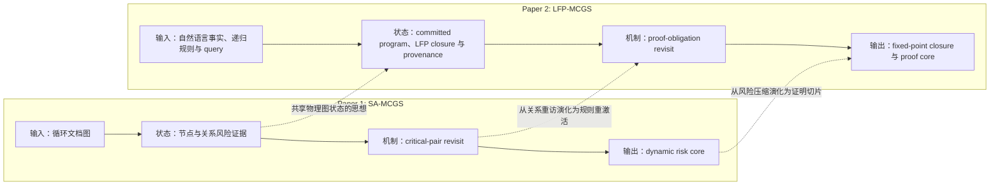
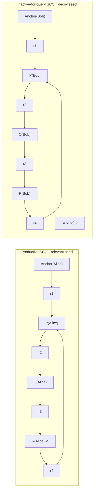
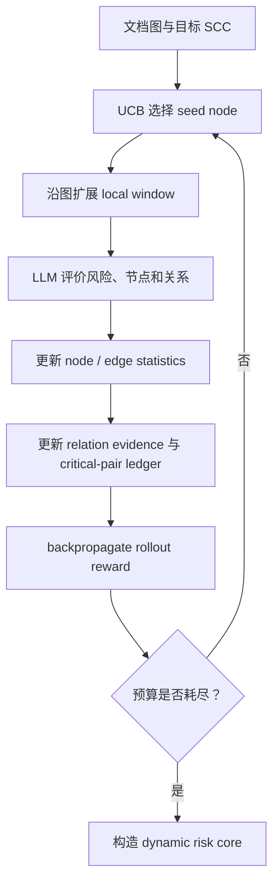
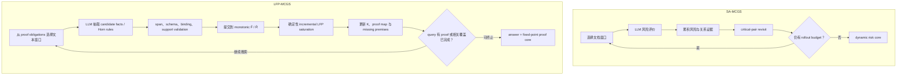
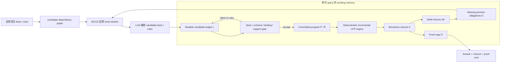
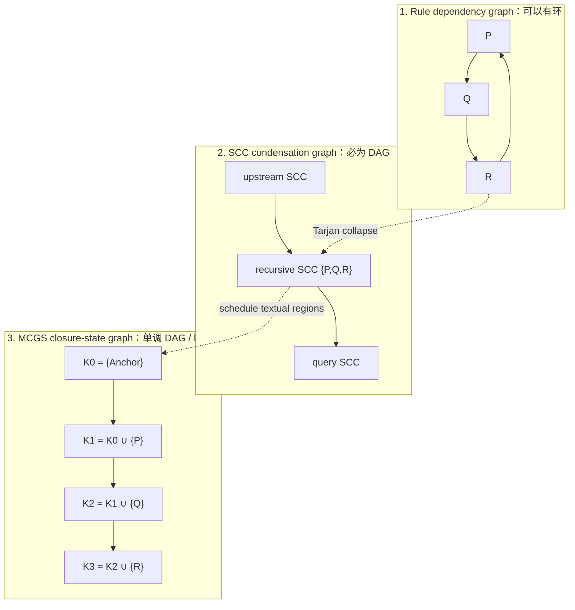
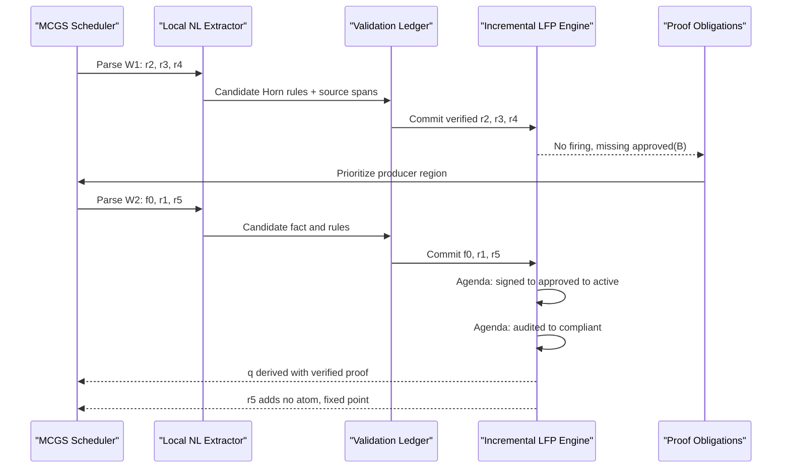
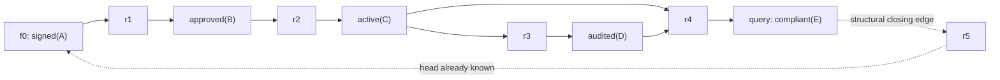

# Paper 2 研究方案：LFP-MCGS

> **状态提示：**这是早期探索初稿，保留用于追溯算法细节；当前数据、baseline、消融和执行门槛以 [`LFP_MCGS_RESEARCH_PLAN_V2.md`](./LFP_MCGS_RESEARCH_PLAN_V2.md) 为准。

> 工作标题：**Beyond Proof Depth: Least-Fixed-Point Reasoning over Cyclic Natural-Language Rules**
> 备选标题：**A Cycle Is Not a Proof: Grounded Search over Recursive Textual Rules**  
> 目标：2026 年 10 月 ARR，后续面向 NAACL / ACL 系列会议  
> 前提：Paper 1（SA-MCGS）已被 EMNLP Findings 接收或正式发表  
> 当前状态：研究设计稿 v0.2，用于决定是否进入两周 pilot

> **命名决定：**正式使用 **LFP-MCGS（Least-Fixed-Point MCGS）**。逻辑学中 `GFP` 通常表示 *greatest fixed point*，而本文严格采用 least-Herbrand-model / least-fixed-point semantics，因此不再使用 GFP 作为方法简称。

---

## 0. 一页结论

Paper 1 研究的是：

> 在循环文档图中，如何反复搜索并保全分布式风险证据？

Paper 2 拟研究的是：

> 在递归自然语言规则中，如何让证据传播到固定点，同时禁止循环规则凭空自证？

核心方法 **LFP-MCGS（Least-Fixed-Point Monte Carlo Graph Search）** 保留 SA-MCGS 的 SCC 定位、局部窗口、UCB 选择、并行 rollout 和物理状态共享，但把搜索过程中的“风险证据记忆”替换为一个**单次查询期间存在的、带证明来源的临时知识库**：

- `L_t`：尚未通过验证的 LLM candidate ledger，可修正、拒绝；
- `F̂_t, R̂_t`：已验证并提交的 base facts 与 Horn rules，只增不减；
- `K_t = lfp_{R̂_t}(F̂_t)`：由**确定性增量求闭包器**计算出的当前 facts；
- `ΔK_t`：本轮闭包中新产生的 facts；
- `Π_t`：每个 fact 的 source-linked proof；
- `O_t`：因缺失 premise 或新 fact 而产生的 proof obligations。

这里最关键的边界是：**LLM 不负责“算固定点”**。LLM 只把局部自然语言片段抽取、规范化为候选 facts / rules；验证通过后，确定性的 least-fixed-point engine 才负责 rule firing、闭包和证明指针。MCGS 优化的是“有限预算下下一处文本该读哪里”，而不是重新发明 Datalog 求值。

最重要的变化不是“给 SA-MCGS 接一个 solver”，而是：

```text
SA-MCGS:
选择窗口 → LLM 风险评价 → 更新风险分数 → 重访冲突关系 → 输出风险核

LFP-MCGS:
选择规则窗口 → LLM 抽取局部 fact / rule → validation gate → 提交到 F̂ / R̂
          → 确定性增量 LFP 产生 ΔK → 缺失前提驱动下一次搜索 → 输出证明核
```

该方向是否值得继续，取决于两周 pilot 能否同时证明：

1. LLM 在 matched cyclic cases 上确实存在 circular-support failure；
2. 原始 SA-MCGS 或普通 iterative prompting 不能自然解决它；
3. LFP-MCGS 相比 full-text `NL → Datalog → solver` 在长、噪声、多干扰规则下具有更好的 proof-valid accuracy / cost Pareto。

### 0.1 为了两个月可完成，先锁死范围

第一版只做一个窄而硬的 scientific question：**在有限 positive-Horn 自然语言规则中，模型能否从真实 seed 饱和 productive SCC，同时拒绝无 seed 的 circular self-support？**

明确不做：

- 不做通用法律 symbolic reasoning；
- 不做 negation-as-failure、例外、时态、规则删除或 belief revision；
- 不训练新 foundation model；
- 不把 GPU batching / serving 作为论文主贡献；
- 不承诺任意自然语言形式化的 soundness；
- 不把自由文本 proof generation 当主任务。

主论文只需要：一个 topology-controlled benchmark、一个 deterministic oracle / verifier、一个 selective local parser，以及从 SA-MCGS 演化来的 proof-obligation scheduler。真实法律或政策文本只作为小规模 transfer / case study，而不是主数据负担。

---

## 1. Paper 1 与 Paper 2 的研究关系

### 1.1 研究演化图



### 1.2 逐项对照

| 维度 | Paper 1：SA-MCGS | Paper 2：LFP-MCGS |
|---|---|---|
| 科学问题 | 循环文档中的风险证据是否能被完整找回 | 循环规则中的结论是否具有 grounded support，证据是否传播到固定点 |
| 输入 | 文档记录、依赖边、SCC | 自然语言事实、自然语言规则、候选依赖图、query |
| 基本状态 | 节点 / 边访问次数、风险分数、关系证据 | committed facts / rules、LFP closure、proof obligations、provenance DAG |
| LLM 角色 | 对局部窗口打风险分并抽取冲突关系 | 把局部自然语言规范化为候选 facts / Horn rules；不直接决定逻辑真值 |
| 搜索奖励 | 风险强度、关系显著性、覆盖 | 新 grounded fact、query progress、有效 provenance、非重复性 |
| 重访触发 | critical pair 达到阈值或按 cadence 重访 | 新 fact 出现后，只重访可能消费该 fact 的规则 |
| 记忆性质 | 风险证据可被动态替换或压缩 | committed fact store 必须单调增长；只有展示用 proof core 可压缩 |
| 停止条件 | rollout budget 用完 | 有 verified proof 时可正向停止；只有相关文本覆盖完且闭包饱和时才能判定非蕴含，否则预算耗尽返回 `Unresolved` |
| 输出 | compact risk subgraph | answer、query-relevant closure、source-linked proof certificate |
| 主要指标 | Risk-all、Root@k、压缩率 | closure F1、paired accuracy、circular-support FPR、proof validity |

### 1.3 哪些是继承，哪些必须是新贡献

**明确继承、不能再次声称为新贡献：**

- SCC localization；
- graph-guided local-window selection；
- UCB / Monte Carlo 式预算分配；
- virtual loss 和并发 rollout；
- transposition / 物理状态共享的基本思想；
- 从局部证据逐步形成紧凑子图的整体范式。

**Paper 2 必须独立成立的新贡献：**

1. topology-controlled 的 grounded recursive textual reasoning 任务；
2. matched relevant-seed / decoy-seed benchmark；
3. mutable candidate ledger 与 monotonic committed program / LFP closure 的分层记忆；
4. source-grounded validation gate 与 deterministic incremental LFP，禁止 circular support；
5. missing-premise / delta-closure driven rule reactivation；
6. static parse cache、closure-state transposition 与 provenance sidecar；
7. query-relevant fixed-point termination 与 proof certificate；
8. closure / provenance 层面的评价，而非只看最终 label。

如果第二篇只是在 Paper 1 的风险任务上增加一个 facts memory，它会显得 incremental；只有以上任务、状态、更新语义和评价共同改变，第二篇才是一篇独立论文。

### 1.4 与已发表 Paper 1 的写作关系

若 SA-MCGS 已公开发表，Paper 2 应把它当普通 prior work 正常引用，并明确写成：`we adapt the graph-search backbone of SA-MCGS`。这不是“作弊”，真正的判断标准是第二篇是否有独立问题、方法增量、数据与结论。

双盲稿中按投稿 venue 当期政策处理 self-citation 与匿名仓库：正文用第三人称、不过度提示作者身份，不写“our previous paper”；公开论文中已存在的方法名和结果可以被比较，但不能把 Paper 1 的文字、图、实验当成新内容重复发表。提交前再按当期 ARR / venue checklist 做一次匿名性审计。

---

## 2. 问题定义

### 2.1 直观问题

递归规则具有两个相反的难点：

1. **Under-reasoning：**存在可达事实时，模型需要反复应用规则，直到证据穿过 SCC 并达到固定点；
2. **Over-reasoning：**不存在可达事实时，模型不能因为规则互相蕴含，就把循环本身当成证明。

一句话 hook：

> **A cycle can propagate evidence, but it cannot create evidence.**

这句话只在本文明确采用的 **inductive / least-fixed-point semantics** 下成立；本文不讨论 coinductive 或 greatest-fixed-point semantics。

### 2.2 最小形式边界

第一版只支持：

- finite constants；
- function-free positive Horn rules；
- least-Herbrand-model / least-fixed-point semantics；
- 可选的 explicit negation，将 `not_p(x)` 当作独立 predicate；
- 无 negation-as-failure；
- 无 existential head；
- 无 function symbols；
- 无 disjunction；
- 无非分层 negation；
- 无通用法律逻辑、时态逻辑或 ASP semantics。

给定 base facts `F` 和 rules `R`，令 `T_R(K)` 表示在事实集合 `K` 上一次可推出的结论，则：

\[
K_0 = F, \qquad
K_{t+1} = K_t \cup T_R(K_t), \qquad
K^* = \bigcup_{t \ge 0} K_t.
\]

因为 domain、constants 和 predicates 有限，且 `K_t` 单调增长，所以该过程最终停止。

### 2.3 输入与输出

**系统可见输入：**

- 一组带 record ID 的自然语言 facts；
- 一组带 record ID 的自然语言 Horn-like rules；
- 文本中显式引用或高召回抽取得到的 candidate dependency graph；
- query `q`。

**系统不可见、仅用于数据生成和评价：**

- gold predicates；
- gold variable bindings；
- gold formal rules；
- gold least-fixed-point closure；
- gold proof DAG。

**系统输出：**

1. `Entailed / Contradicted / Unknown`；
2. query-relevant fixed-point closure；
3. 每个预测 fact 的原文 rule / fact provenance；
4. 若 query 被证明，输出所有叶节点均为显式事实的 proof core；
5. 若预算不足以饱和 frontier，输出 `Unresolved`，而不能把“尚未找到”错误地报告成 `Unknown`。

### 2.4 为什么主任务不能只有 Boolean QA

在有限、单调 Datalog 中，一个已蕴含的 ground atom 总能展开为有限的 DAG proof。因此，如果只评价 query 的 True / False，reviewer 可以合理质疑：循环是不是仅仅作为冗余边存在。

因此主任务必须至少评价：

- complete query-relevant closure；
- grounded propagation recall；
- proof / provenance validity；
- productive SCC 是否被完整饱和；
- inactive SCC 是否产生 circular hallucination。

最终 label accuracy 只能是指标之一，不能是唯一 headline。

---

## 3. Matched 例子：循环能传播，但不能自证

两条样本具有完全相同的 rules、SCC、query、文本长度和事实数量；唯一差异是 seed 是否与 query 实体相关。

```text
Rules（两边完全相同）:
r1: If Anchor(x) holds, then P(x) holds.
r2: If P(x) holds, then Q(x) holds.
r3: If Q(x) holds, then R(x) holds.
r4: If R(x) holds, then P(x) holds.

Query: R(Alice)

Positive: Anchor(Alice)
Negative: Anchor(Bob)       # decoy seed，不是简单地“删除事实”
```



正确结果：

- Positive：`R(Alice)` 被证明，closure 至少包含 `P(Alice), Q(Alice), R(Alice)`；
- Negative：循环可以在 Bob 上传播，但不能创造关于 Alice 的事实，因此 query 为 `Unknown`；
- 若模型仅因为看见 `P → Q → R → P` 就预测 `R(Alice)`，这是 circular-support false positive。

---

## 4. 原始 SA-MCGS 的运行过程

### 4.1 SA-MCGS 主循环



### 4.2 原方法擅长什么

当前实验证据说明，SA-MCGS 最可靠的优势不是 relation-first memory 本身，而是：

- graph-guided local-window selection；
- critical-pair ledger / revisit；
- dynamic / replacement core；
- 物理节点级共享，避免 TreeMCTS 在循环中复制相同记录。

已有消融中：

- 移除 critical-pair ledger / revisit，Risk-all 从 `75.0%` 降至 `53.8%`；
- 随机窗口把 Risk-all 从 `75.0%` 降至 `63.7%`；
- 将 dynamic / replacement core 替换为简单 monotone accumulation，Risk-all 从 `70.0%` 降至 `45.0%`。

这些结果提供了一个合理先验：**当关键信息必须跨多次局部观察持续保留并重新激活时，SA-MCGS 的图搜索骨架是有价值的。** Paper 2 将这一经验现象转化为具有精确语义的 fixed-point evidence reasoning。

---

## 5. LFP-MCGS 对 SA-MCGS 做了什么改变

### 5.1 总体流程对照



### 5.2 组件映射

| SA-MCGS 组件 | LFP-MCGS 中的处理 | 是否可直接复用 |
|---|---|---|
| SCC detection | 定位 recursive predicate / record components | 是 |
| adjacency / reverse adjacency | 表示 candidate rule dependency | 是 |
| UCB seed selection | 选择最可能产生新 grounded facts 的规则或窗口 | 公式和统计需改 |
| local window expansion | 围绕 active rule、premise 与 query 扩展 | 骨架可复用 |
| virtual loss / concurrency | 并发探索不同 rule frontiers | 是 |
| transposition table | 缓存 canonical window 的语义解析；若 prompt 依赖当前 closure，则 key 加 projected state | key 与 provenance sidecar 必须重写 |
| node risk statistics | rule productivity / query relevance statistics | 重写 |
| edge risk statistics | premise-to-rule activation statistics | 重写 |
| LLM risk evaluator | local NL → candidate fact / Horn-rule extractor | 完全替换 |
| critical-pair ledger | missing-premise tuple / proof-obligation ledger | 思想复用，结构重写；conjunction 不能只记 pair |
| OC signal | new-fact / stall / saturation signal | 不直接复用 |
| dynamic risk core | verified proof DAG 的 backward slice | 输出思想复用；可换更短展示 proof，但不能撤销 closure 中的 truth |
| repair entry nodes | 无对应物 | 删除 |

### 5.3 新状态定义

第 `t` 次更新后的完整状态写为：

\[
S_t = (\hat F_t, \hat R_t, K_t, \Pi_t, L_t, O_t, C_t, Z_t, H_t, I_t).
\]

| 符号 | 含义 | 是否单调 |
|---|---|---|
| `F̂_t` | 已验证并提交的 canonical base facts | 是 |
| `R̂_t` | 已验证并提交的 grounded / function-free positive Horn rules | 是 |
| `K_t` | `lfp_{R̂_t}(F̂_t)`，当前已饱和的逻辑闭包 | 是 |
| `Π_t` | atom 到 base fact 或 `(rule, child proofs)` 的 proof map | truth support 单调；展示 proof 可替换为更短版本 |
| `L_t` | 尚未通过验证的候选 fact / rule ledger | 否，可修正、聚合或拒绝 |
| `O_t` | 未解决 proof obligations：缺失 premise 集、潜在 producer region、距 query 的距离 | 否 |
| `C_t` | 已覆盖的 record / edge / window | 是 |
| `Z_t` | visit、value、virtual-loss 等 MCGS 统计 | 在线更新 |
| `H_t` | canonical window 的局部语义解析 cache | 只增；受 prompt / model version 约束 |
| `I_t` | 当前 in-flight windows | 否 |

另记 `ΔF_t, ΔR_t` 为本轮新提交的程序元素，`ΔK_t = K_t \ K_{t-1}` 为增量闭包结果。实现时可以把它们作为 event log，而不必永久放入状态元组。

**关键设计原则：**

> 不确定、可能被修正的 LLM 输出留在 `L_t`；只有通过 source-span、schema、binding 和 support 检查的 facts / rules 才进入 `F̂_t, R̂_t`。随后由确定性 LFP engine 更新 `K_t`，LLM 不能直接把一个 conclusion 写入 `K_t`。

`K_t` 一旦由 committed program 推出就不允许像 Paper 1 的 dynamic core 那样删除。否则系统就不再是标准 least-fixed-point evaluation，而会变成另一个 belief-revision 问题。

### 5.4 临时知识库的内部结构



一个 candidate / committed rule 至少记录：

```yaml
rule_id: r2
canonical_rule: "P(x) -> Q(x)"
status: committed
source_spans:
  - record_id: rule_2
    span: "If P holds for an entity, Q also holds."
variables: [x]
schema: positive_horn
validation:
  span_grounded: true
  binding_consistent: true
commit_round: 4
```

相应的 `Q(Alice)` 不是 LLM proposal 本身，而是在 `P(Alice) ∈ K_t` 后，由 LFP engine 对 `r2[x := Alice]` firing 得到，并在 `Π_t` 中记录 `Rule(r2, [Π(P(Alice))])`。

### 5.5 LLM evaluator 的新输出

原 `_evaluate(window)` 返回风险分数和冲突节点；新 evaluator 只做**局部语义规范化**，返回候选 base facts、positive Horn rules 和对应原文 span：

```json
{
  "facts": [],
  "rules": [
    {
      "rule_id": "r2",
      "variables": ["x"],
      "body": ["P(x)"],
      "head": "Q(x)",
      "source_spans": ["rule_2: If P holds ... Q also holds"],
      "confidence": 0.91
    }
  ],
  "ambiguous_mentions": [],
  "unsupported_fragments": []
}
```

候选 fact / rule 只有同时满足以下条件才可提交到 `F̂_t / R̂_t`：

1. record ID 来自当前窗口，source span 能逐字回溯到输入；
2. predicate、constant 和 entity ID 已 canonicalize 到当前 vocabulary；
3. rule 满足限定的 positive Horn schema，variable scope 和 binding 一致；
4. body / head 的方向、量词范围和条件边界通过 verifier；
5. 重复采样、独立 verifier 或 `k`-support 达到预设接受阈值；
6. 无法可靠解析时留在 `L_t` 或 abstain，不强行提交。

规则是否能够 firing **不由 LLM 判断**。例如 `r2: P(x) → Q(x)` 可以在 `P(Alice)` 尚未出现时先提交到 `R̂_t`；之后只要 `P(Alice)` 进入 `K_t`，确定性 LFP engine 就实例化并推出 `Q(Alice)`。因此，循环 `P→Q→R→P` 在没有 base seed 时不会自行启动。

形式保证只能条件化地表述为：

> 如果提交的局部 facts / rules 语义解析正确，则增量 LFP engine 保证每个 `K_t` 中的 atom 都存在一个以显式输入事实为叶节点的有限证明。

它不能保证 LLM 永远没有误读自然语言，因此必须分别报告 gold-parse reasoning 与 predicted-parse end-to-end 结果。

### 5.6 Delta-triggered revisit

Paper 1 的 critical-pair revisit 是“某对关系持续可疑，所以再次观察”；LFP-MCGS 的重访更具确定语义：

```text
如果本轮新增 Q(Alice)：
  1) 对已提交规则，只唤醒 uses[Q] 中的规则；
  2) 对尚未解析的文本，优先搜索可能产生或消费 Q 的 producer / consumer windows；
不重新扫描所有文本，也不因为候选图形成环就自动产生结论。
```

设 `uses(a)` 是已提交程序中 body 含 atom `a` 的规则索引，`ProducerWindows(a)` 是候选图上可能产生缺失 atom `a` 的未覆盖窗口，则：

\[
O_{t+1} \leftarrow Update\bigl(O_t, \Delta K_t, uses, ProducerWindows\bigr).
\]

这相当于把 semi-naive evaluation 的增量原则嵌入带有不确定文本解析的 MCGS：确定性 engine 负责“已知程序怎么推”，MCGS 负责“下一段自然语言程序去哪里找”。对于 conjunction，obligation 必须记录完整 missing-premise set / tuple，不能退化为 Paper 1 的二元 pair。

### 5.7 State-conditioned transposition

这里要分开两个 cache，避免把“文本解析”与“逻辑状态”混为一谈：

```text
Static parse cache H:
    (canonical_window_ids, prompt_version, model_version)

MCGS closure-state key:
    (committed_program_signature, relevant_closure_signature,
     uncovered_region_signature, query_signature)
```

默认的局部抽取 prompt 不读取 `K_t`，因此相同文本窗口可以安全复用静态 parse。如果为了消歧而把当前 facts / obligations 放进 prompt，则 `H` 的 key 必须额外加入 `K_t ∩ Atoms(window)`；否则会错误复用旧状态的输出。

不同搜索路径到达同一 closure state 时可以合并调度统计，但不能丢掉证明来源：transposition node 保存 multi-parent provenance sidecar，`Π_t` 仍保留所有需要评价或展示的独立 support。

### 5.8 Selection 与 reward

LFP-MCGS 仍然在有限 LLM 调用预算下选择局部窗口，但 exploitation 的含义从“风险高”改为“最可能推进 grounded closure”。可以先使用下列可解释版本：

\[
Score(w) = \frac{Q(w)}{N(w)+\epsilon}
+ c\sqrt{\frac{\log(1+N_{all})}{N(w)+VL(w)+\epsilon}}
+ \lambda_1 Rel_q(w)
+ \lambda_2 Deficit(w,K_t)
+ \lambda_3 Unseen(w).
\]

其中 `Deficit` 优先覆盖 near-fireable rule 的缺失 premise，或沿 dependency graph 回溯该 premise 的潜在 producer window；`VL` 是并发 rollout 的 virtual loss。

单次 rollout reward 可定义为：

\[
r_t = \alpha \frac{|\Delta K_t|}{|Atoms|}
+ \beta \mathbf{1}[q\text{ newly derived}]
+ \gamma \Delta ClosedObligations_t
+ \xi \Delta Coverage_t
- \eta Invalid_t
- \mu Cost_t.
\]

第一版不要追求复杂学习式 reward；应先证明 `delta readiness + query relevance + provenance validity` 足以构成稳定贡献。

### 5.9 三张图不能混为一张图

这篇论文实际同时涉及三种图。它们的“循环”含义不同，正文必须显式区分：



- **规则依赖图**允许回边，是任务中 recursion 的来源；
- **SCC condensation graph**只用于分区和跨区调度，本身无环；
- **closure-state graph**因为 `F̂_t, R̂_t, K_t` 只增不减，所以也是 DAG / lattice，不能画成会撤回事实的循环状态机。

MCGS 的 transposition 发生在第三张图：不同 window 顺序若到达同一 committed program 与 closure，可以共享搜索统计；但 proof provenance 作为 sidecar 保留。

### 5.10 Fixed-point termination

正向情形中，只要 `q ∈ K_t` 且 `VERIFY_PROOF(Π_t[q])` 成功，就可以提前返回 `Entailed + proof`。反向情形更严格：agenda 为空只说明**当前已抽取程序**饱和，不代表完整自然语言输入下不蕴含。

严格返回 `Unknown / Not Entailed` 需要满足：

1. committed program 的 incremental LFP agenda 已清空；
2. 最近一轮没有新 `ΔF, ΔR, ΔK`；
3. 没有仍可能改变 query 的 pending candidate；
4. query-relevant producer regions 已达到预先定义的 coverage / fairness 条件。

如果预算耗尽但以上条件不成立，返回 `Unresolved`，而不是 `Unknown`。

有限预算下，LFP-MCGS 是一个 anytime recovery method，不能无条件声称 completeness。只有当所有正确候选规则最终都被访问、局部解析正确且 frontier 被完全处理时，才能达到 gold fixed point。

### 5.11 Proof core

Paper 1 的 dynamic core 可以动态替换风险节点；Paper 2 必须把两个概念分开：

- **Grounded store `K_t`：**逻辑计算状态，只增不减；
- **Proof core `H_q`：**从 query 沿 `Π_t` 反向切片得到的展示子图，可以压缩、选择最短或最高置信证明。

如果 query 有多个独立证明，可同时报告：

- one valid proof；
- all recovered support；
- minimal-size proof（仅在 verifier 确认可用时称 minimal）；
- proof compression ratio。

---

## 6. LFP-MCGS 伪代码

```text
Algorithm: LFP-MCGS(G, query q, budget B)

Input:
    G       candidate graph over natural-language facts and rules
    q       canonical query atom
    B       maximum LLM evaluation budget

State:
    Fhat, Rhat    verified committed facts and Horn rules
    K, Pi         saturated LFP closure and proof map
    Ledger        provisional candidates
    Obligations   missing premises and uncovered producer regions
    Coverage      visited records / edges / windows
    Stats         visits, values, and virtual loss
    ParseCache    canonical-window semantic parse cache

1. SCC <- TARJAN(G)
2. initialize empty state
3. commit machine-visible base facts, if any, to Fhat
4. INCREMENTAL_SATURATE(deltaF=Fhat, deltaR=empty)
5. initialize query-relevant obligations and coverage

6. while LLM calls < B:
7.     while fewer than c windows are in flight:
8.         seed <- SELECT_UCB(Obligations, Coverage, Stats, q)
9.         window <- EXPAND(seed, G, max_window_size)
10.        APPLY_VIRTUAL_LOSS(window)
11.        dispatch LOCAL_EXTRACT(window)

12.    observation <- first completed local extraction
13.    candidates <- VALIDATE_AND_CANONICALIZE(observation, window)
14.    Ledger.observe(candidates)
15.    deltaF, deltaR <- COMMIT_READY(Ledger)
16.    Fhat <- Fhat union deltaF
17.    Rhat <- Rhat union deltaR
18.    deltaK <- INCREMENTAL_SATURATE(deltaF, deltaR, K, Pi)
19.    UPDATE_OBLIGATIONS_AND_COVERAGE(deltaK, deltaR)
20.    reward <- PROGRESS_REWARD(deltaK, obligations_closed, q, cost)
21.    BACKPROPAGATE(window, reward)
22.    REMOVE_VIRTUAL_LOSS(window)

23.    if q in K and VERIFY_PROOF(Pi[q]):
24.        return ENTAILED, MINIMIZE_DISPLAY_PROOF(Pi[q])

25.    if RELEVANT_COVERAGE_COMPLETE(q) and
           Ledger cannot affect q and LFP agenda is empty:
26.        return UNKNOWN, coverage_certificate

27. return UNRESOLVED, current_closure_and_proof_frontier
```

并发时按 first-completed-first-processed 更新状态；virtual loss 只避免多个 worker 重复选择相同窗口，不参与逻辑真值判断。

### 6.1 确定性的增量 LFP 内核

MVP 在 finite constants 上把已验证的 function-free rules 物化为 query-relevant ground instances；下文的 `r` 指一个 ground rule instance。维护 `uses[a]`（body 中含 `a` 的规则）、`satisfied[r]`、`fired[r]`、atom agenda 和 rule agenda。每个 atom 最多首次入闭包一次，每条已实例化规则最多首次 firing 一次。

```text
INCREMENTAL_SATURATE(deltaF, deltaR, K, Pi):
    deltaK <- empty

    for rule r in deltaR:
        index r under every premise atom a in body(r)
        satisfied[r] <- body(r) intersect K
        if body(r) subset of satisfied[r] and not fired[r]:
            ruleAgenda.push(r)

    for fact f in deltaF:
        if f not in K:
            K.add(f)
            Pi[f] <- Fact(f, source_span)
            atomAgenda.push(f)
            deltaK.add(f)

    while atomAgenda is not empty or ruleAgenda is not empty:
        while atomAgenda is not empty:
            a <- atomAgenda.pop()
            for r in uses[a]:
                satisfied[r].add(a)
                if body(r) subset of satisfied[r] and not fired[r]:
                    ruleAgenda.push(r)

        while ruleAgenda is not empty:
            r <- ruleAgenda.pop()
            if fired[r]: continue
            fired[r] <- true
            h <- head(r)
            if h not in K:
                K.add(h)
                Pi[h] <- Rule(r, [Pi[p] for p in body(r)])
                atomAgenda.push(h)
                deltaK.add(h)

    return deltaK
```

工程实现要给同批 `deltaF / deltaR` 加 membership guard，避免重复计数。若某条 closing rule 的 head 已在 `K` 中，它可以标为 fired，但不会新增 atom；因此没有 base seed 的 cycle 永远不能 bootstrap。

### 6.2 算法不变量与保证边界

1. **Monotonicity：**`K_t ⊆ K_{t+1}`；
2. **Program monotonicity：**`F̂_t ⊆ F̂_{t+1}` 且 `R̂_t ⊆ R̂_{t+1}`；
3. **Saturation：**每次 update 结束后，`T_{R̂_t}(K_t) = K_t`；
4. **Leastness：**`K_t` 是从 `F̂_t` 出发得到的最小固定点，而非任意可满足 model；
5. **Relative proof soundness：**对每个 `a ∈ K_t`，`Π_t[a]` 都是相对于 committed program 的有限 proof；
6. **No circular self-support：**只有 body 全部已派生时 rule 才能 firing；无 seed 的 `a→b, b→a` 不导出 atom；
7. **Proof closure：**返回的 proof core 递归包含每条 rule 的所有 premises，直到 base-fact leaves；
8. **Termination：**在 finite, grounded/function-free positive Horn 边界内，atom 和 rule incidence 有限；
9. **Cache safety：**state-conditioned prompt 的 cache key 必须包含 window 上的 projected closure；
10. **Conditional completeness：**只有 fair search 覆盖全部 query-relevant windows，且 extractor 对相关 facts / rules sound and complete 时，才恢复 gold LFP；
11. **One-sided anytime correctness：**verified entailment certificate 可以随时接受；预算内没找到 proof 不能直接当成 non-entailment。

### 6.3 非 LLM 复杂度

令 ground atom 数为 `n`，query-relevant ground rule instances 数为 `m`，总 body incidence 为 `L = Σ_r |body(r)|`，LLM rollout 数为 `B`，窗口大小为 `w`，最大度为 `d`：

- Tarjan SCC：`O(|V| + |E|)`；
- 整个 run 的增量 LFP：`O(n + m + L)` 时间与空间；若每次 rollout 都从头求闭包会退化为 `O(BL)`，应避免；
- 朴素扫描式 UCB：约 `O(B(|V| + wd))`；priority queue 可近似降到 `O(B(log|V| + wd))`；
- 第一条 proof 的 `Π`：`O(n + L)`；每个 atom 保留 `k` 条 alternative proofs 时约 `O(kn + L)`；
- LLM 成本：`B` 次局部调用，才是系统的主要成本。本文优化目标是减少需要语义解析的窗口，而不是加速确定性 Horn closure。

---

## 7. 一个完整运行轨迹

考虑下列自然语言 records 对应的隐藏程序；模型只看 records，不看这里的 canonical form：

```text
f0: signed(A)
r1: signed(A) -> approved(B)
r2: approved(B) -> active(C)
r3: active(C) -> audited(D)
r4: active(C) and audited(D) -> compliant(E)    # query
r5: compliant(E) -> signed(A)                   # closes the SCC
```

运行过程：

| 阶段 | MCGS 选择与 LLM 工作 | committed program | 确定性 LFP 结果 | 新 obligation / 结果 |
|---:|---|---|---|---|
| 0 | 尚未读取相关文本 | `F̂=∅, R̂=∅` | `K=∅` | 从 query 反向初始化 frontier |
| 1 | query-directed `W1={r2,r3,r4}`；LLM 只解析三条规则 | `R̂={r2,r3,r4}` | 无 rule 可 firing，`K=∅` | 缺 `approved(B)`，沿 producer edge 回溯 |
| 2 | `W2={f0,r1,r5}`；LLM 解析 seed 与两条规则 | `F̂={f0}`，`R̂={r1…r5}` | agenda 连续推出 `signed→approved→active→audited→compliant` | query 得到 verified proof |
| 3 | 检查 closing rule `r5` | 不变 | `signed(A)` 已存在，`ΔK=∅` | 到达 fixed point；`r5` 不进入最短 proof |



结构上的 cycle 与实际 proof 不是一回事：



实线是返回的 proof core；虚线 `r5` 属于 recursive SCC，却不属于最短证明。去掉 `f0` 后，所有规则都不能 firing；即使结构环仍完整，也不能自证 `compliant(E)`。

---

## 8. Benchmark 设计

### 8.1 数据生成原则

每个样本从隐藏的 formal Horn program 生成，再自然语言化。formal program 只用于 oracle，不作为模型输入。

每个 matched group 至少包含：

1. **Relevant-seed SCC：**seed 可进入 query-relevant recursive component；
2. **Decoy-seed SCC：**事实数量相同，但 seed 属于错误实体、错误 guard 或不可达 component；
3. **Matched DAG：**尽量匹配 facts、rules、proof depth、词汇和 distractors，但移除 recursive feedback；
4. **Paraphrase variant：**逻辑不变、语言表面形式变化；
5. **No-op distractor variant：**增加与 query 无关但词汇高度相似的规则。

不能把负例简单做成“删除 seed”，否则模型只需检查输入中是否少了一个事实。

### 8.2 控制变量

| 轴 | 建议取值 |
|---|---|
| SCC size | `3, 5, 8, 12, 20` rules |
| fixed-point rounds | `1, 2, 3, 5, 8` |
| entry seeds | `relevant, decoy-entity, decoy-guard, unreachable` |
| feedback edges | `1, 2, 4, dense` |
| branching factor | `1, 2, 3` |
| distractor ratio | `0%, 25%, 50%, 100%` |
| language style | template、LLM paraphrase、human paraphrase |
| query label | entailed、explicitly contradicted、unknown |
| graph observation | gold structure diagnostic、predicted candidate graph end-to-end |

### 8.3 数据规模

**两周 pilot：**

- `120` matched groups；
- 每组 Positive + Decoy Negative，共 `240` instances；
- 重点覆盖 3 / 5 / 8 fixed-point rounds；
- 先使用一个中等模型和一个强模型；
- 只做 template + 一种 paraphrase。

**完整论文：**

- 自动生成 `4,000–6,000` matched groups，主要用于覆盖 topology / language 条件和低成本模型分析；
- 冻结的主测试集 `600–800` groups；高成本方法只跑其中预注册的 `300–400` 个分层样本，并对所有方法使用完全相同子集；
- 至少 `120` groups 做人工逻辑检查与 human paraphrase；
- split 按 topology family、predicate vocabulary 和 paraphrase template 划分，禁止仅随机拆分；
- 额外构造一个 ProofWriter-compatible cyclic subset，检查与既有 benchmark 的接口。

### 8.4 两种评价设置

1. **Gold-structure diagnostic：**提供正确的 record dependency topology，但不提供 formal rules / bindings，用于隔离 reasoning failure；
2. **End-to-end：**只给自然语言 records 与显式引用，由高召回 candidate graph builder 构图，再运行 LFP-MCGS。

主论文必须同时报告两者，以区分：

- graph construction error；
- local semantic parsing error；
- fixed-point search / memory error。

---

## 9. 实验设计

### 9.1 Baselines

| 类别 | Baseline | 作用 |
|---|---|---|
| Oracle | Gold Datalog fixed-point solver | 数据与理论上界，不是要击败的方法 |
| Direct | Full-context direct answer | 测试单次长上下文能力 |
| CoT | Full-context Chain-of-Thought | 测试线性显式推理 |
| Iterative | one-step implication / working-memory prompting | 测试普通迭代是否已足够 |
| Neuro-symbolic | full-text `NL → Datalog → solver` | 最危险的强 baseline，对应 LINC / Logic-LM 范式 |
| Retrieval | deterministic query-relevant windows + aggregation | 测试普通 graph decomposition |
| Tree search | TreeMCTS over rule applications | 测试 path-copy 和循环重复 |
| Paper 1 backbone | SA-MCGS-Fact | 同样的 window / UCB，但无 anchored store、delta revisit、fixed-point termination |
| Proposed | LFP-MCGS | 完整方法 |

`SA-MCGS-Fact` 必须定义清楚：允许 evaluator 输出 candidate facts，但仍按原 SA-MCGS 的 stateless / risk-like aggregation 工作。这样才能证明新贡献不是仅仅换 prompt schema。

### 9.2 主指标

**正确性：**

- `Paired Accuracy`：matched Positive / Decoy Negative 两条都正确才计 1；
- `Proof-Carrying Accuracy`：label 正确且 proof 通过 verifier；
- `Query-Relevant Closure Precision / Recall / F1`；
- `Circular-Support FPR`：无 relevant seed 时错误 entail 的比例；
- `Grounded-Propagation Recall`：有 relevant seed 时 closure 的完整恢复率；
- `Provenance Validity`：每条 proof edge 是否对应输入 rule / fact；
- `Saturation Accuracy`：是否正确区分 Fixed Point、Unknown 与 Unresolved。

**结构诊断：**

- SCC-vs-DAG matched gap；
- fixed-point rounds 曲线；
- SCC size 曲线；
- feedback-edge density 曲线；
- query entry / exit completeness。

**成本：**

- LLM calls / tokens；
- calls-to-first-valid-proof；
- new grounded facts per call；
- percentage of records / rules semantically parsed；
- duplicate proposal rate；
- TT hit rate；
- end-to-end wall-clock time。

### 9.3 核心消融

| Ablation | 检验问题 |
|---|---|
| No anchored provenance | 循环是否会产生 self-support false positives |
| No proof-obligation / delta revisit | productive SCC 是否无法传播到 closure |
| Window-only TT key | 是否因复用 stale state 漏掉新 rule firing |
| No mutable candidate ledger | 一次性错误是否污染 committed program |
| No semantic / repeated verification | LLM 误读是否被不可逆地提交 |
| No query slicing | 全图探索是否浪费预算并降低 precision |
| Random windows | 增益是否仅来自重复 prompting |
| Deterministic exhaustive windows | MCGS 调度是否真的必要 |
| No proof-core extraction | 输出是否仍可审计、是否过度膨胀 |
| Gold local parses | 瓶颈究竟在 parsing 还是 search / memory |

### 9.4 最重要的对照实验

必须画三条 Pareto 曲线：

1. Proof-Carrying Accuracy vs. LLM calls；
2. Closure F1 vs. tokens；
3. Circular-Support FPR vs. Grounded-Propagation Recall。

我们不应只证明 LFP-MCGS 更准确，而应证明它在**不过度接受 circular support**的同时，仍能充分传播真正的 grounded evidence。

---

## 10. 两周 Pilot 与 Go / No-Go

### 10.1 Week 1：先验证问题是否真实存在

1. 实现 hidden Horn generator 与 exact closure / proof oracle；
2. 生成 `120` matched groups；
3. 跑 Direct、CoT、full-text parse-then-solve、普通 iterative working memory；
4. 测量：
   - circular-support FPR；
   - Positive / Decoy paired gap；
   - SCC / DAG matched gap；
   - closure recall 随 fixed-point rounds 的下降。

### 10.2 Week 2：验证 MCGS 是否必要

1. 实现最小 `CandidateLedger + ValidationGate + IncrementalLFP + ObligationFrontier`；
2. 复用现有 local-window / UCB / concurrency 骨架；
3. 比较 SA-MCGS-Fact、deterministic windows 和 LFP-MCGS；
4. 做最关键的三项消融：
   - no provenance；
   - no delta revisit；
   - window-only TT key。

### 10.3 建议 Go 条件

满足以下大部分条件再进入完整论文：

- 至少一个强模型在 hard matched cases 上仍有 `≥10` points paired-accuracy gap 或 `≥15%` circular-support FPR；
- closure recall 随 fixed-point rounds 明显下降，而不仅是随文本长度下降；
- LFP-MCGS 相比 SA-MCGS-Fact / budget-matched deterministic scheduler 在 Closure F1 或 Proof-Carrying Accuracy 上提升 `≥7–10` points；
- no provenance 显著提高 circular-support FPR；
- no delta revisit 显著降低 productive closure recall；
- provenance validity 达到 `≥90%`，且 human paraphrase 上仍保留主要增益；
- full-text parse-then-solve 在长、噪声设置下出现累积 parsing error，LFP-MCGS 用不超过约 `40–60%` 的文本解析量达到其 `≥95%` 的准确率，或取得更好的 accuracy / cost Pareto。

### 10.4 明确 No-Go 条件

出现以下任一情况，应停止或转向更小的 Cyclic Handoff Consistency 任务：

- full-text `NL → Datalog → solver` 在所有设置都接近 oracle，且成本不高；
- Direct / CoT 没有 measurable circular-support failure；
- deterministic exhaustive windows 与 LFP-MCGS 基本相同；
- 关闭 provenance 或 delta revisit 的影响小于 `3–5` points；
- 只有最终 label 提升，但 closure / proof validity 没有提升；
- 效果只存在于单一模板，换 paraphrase 后消失。

---

## 11. 实现方案：如何复用当前仓库

### 11.1 建议新增模块

不要直接在风险专用的 `alphago_mcgs.py` 上堆大量条件分支。Pilot 阶段建议新增轻量实现：

```text
src/models/symbolic_reasoning.py
    GroundAtom
    PositiveHornRule
    CandidateParse
    ProofPointer
    FixedPointResult

src/modules/provenance_store.py
    CandidateLedger
    CommittedProgram
    ProofMap
    ValidationGate

src/modules/incremental_lfp.py
    IncrementalLFPEngine
    RuleUseIndex
    ProofVerifier

src/modules/gfp_mcgs.py
    LFPMonteCarloGraphSearch

experiments/gfp_mcgs/
    generate_recursive_benchmark.py
    run_baselines.py
    run_gfp_mcgs.py
    verify_proofs.py
    analyze_results.py
```

### 11.2 当前代码映射

| 当前 SA-MCGS 位置 / 概念 | Pilot 处理 |
|---|---|
| `DependencyGraph`, `SCCInfo` | 直接复用图容器和 SCC 元数据 |
| `search()` 并发批次骨架 | 复用，但增加 verified-proof early stop 与 coverage-aware negative stop |
| `_init_state()` | 扩展初始化 `F̂, R̂, K, Π, L, O, C, Z, H, I` |
| `_select_and_expand()` | 保留图窗口扩展，加入 delta / query priorities |
| `_apply_virtual_loss()` | 直接复用 |
| `_evaluate()` | 替换为 local fact / positive-Horn-rule extraction prompt 与 schema |
| transposition table | 拆为 static parse cache 与 closure-state transposition；proof provenance 独立保留 |
| `_backpropagate()` | reward 改为 grounded progress |
| `_update_oc()` | 删除或替换为 novelty / saturation tracker |
| critical-pair ledger | 新建 missing-premise tuple / proof-obligation ledger |
| `_build_result()` | 输出 answer、closure、provenance、saturation status |

### 11.3 重构策略

1. **Pilot 前不重构 Paper 1 代码。**先复制最小搜索骨架到新类，避免破坏已发表实现；
2. Pilot 通过后，再抽象 `GraphWindowSearchBase`，共享 adjacency、UCB、virtual loss 和并发逻辑；
3. risk evaluator 与 symbolic evaluator 保持完全独立；
4. 所有 incremental LFP、proof verifier 和 oracle 必须是 deterministic、可单元测试的；
5. LLM output 永远先进入 candidate ledger，不能直接写入 closure `K`；
6. Pilot 中不要实现通用 Datalog：只支持本文声明的 finite grounded/function-free positive Horn 边界。

---

## 12. 八周执行计划

| 周次 | 目标 | 必须交付 |
|---:|---|---|
| W1 | 问题验证 | formal spec、generator、oracle、120 matched groups、Direct / CoT / parse-solve 结果 |
| W2 | 最小方法验证 | CandidateLedger、ValidationGate、incremental LFP、proof obligations、SA-MCGS-Fact 与 LFP-MCGS pilot、Go / No-Go 决策 |
| W3 | 完整搜索状态 | parse cache、closure-state TT、query slicing、trace logger、单元测试 |
| W4 | 方法稳定 | 并发、virtual loss、proof core、Unknown / Unresolved 判定、主要消融 |
| W5 | Benchmark 冻结 | topology split、paraphrase split、hard test、human-check subset、数据卡 |
| W6 | 主实验 | 两个 backbone models、全部 baselines、成本匹配、主要表格 |
| W7 | 分析 | SCC / DAG、rounds、circular FPR、closure、错误类型、第三模型 hard subset |
| W8 | 论文 | 8 页主体、appendix、reproducibility、匿名代码包、内部 mock review |

---

## 13. Reviewer 最可能攻击的点

### 13.1 “Datalog solver 几十行就能解决”

**这个批评在 gold formal input 下完全正确。**

应对：

- 主设置只给自然语言，不给 gold predicates / bindings / formal rules；
- Datalog solver 是 oracle；
- full-text autoformalization + solver 是强 baseline；
- LFP-MCGS 的问题是预算内的 selective semantic interpretation，而不是发明新的 Datalog evaluation；
- 一旦局部程序被验证并提交，所有 rule firing 都交给标准、确定性的 incremental LFP engine。算法新意在“读哪些文本、何时重访、如何保留可核验证据”。

### 13.2 “已有 benchmark 也有 cycles”

不能声称 existing benchmarks are acyclic，也不能声称 first cyclic / fixed-point benchmark。

安全 claim：

> Existing benchmarks may contain recursion, but rarely isolate productive SCCs, query-relevant grounding, and fixed-point rounds as matched structural variables while evaluating complete evidence closure.

### 13.3 “单个 query 总有 DAG proof，为什么需要 cycle？”

应对：

- 主指标不是只有 Boolean answer；
- 评价 complete query-relevant closure 和 provenance recovery；
- matched DAG / SCC 控制 proof depth 与长度；
- 分析多轮 support 对后续规则激活的影响。

### 13.4 “你只是把第一篇改了一个 memory”

应对：

- 新 task、formal semantics、matched benchmark；
- 新 search state、transition、TT key、termination 与 output；
- 原 SA-MCGS-Fact 作为 baseline；
- 明确列出从 Paper 1 继承的组件，不重复声称贡献；
- 不复用第一篇的文字、主结果或图作为新贡献。

### 13.5 “proof 只证明了错误的 LLM 解析”

应对：

- 报告 gold parse 与 predicted parse 两层结果；
- 每条 proof edge 绑定 source span；
- 人工检查 local semantic accuracy；
- candidate ledger + repeated / independent verification；
- 允许 abstain；
- 只声称 conditional soundness，不声称自然语言语义被绝对形式化。

### 13.6 “A Cycle Is Not a Proof 并非总成立”

应对：第一页明确限定：

> finite, function-free, positive Horn programs under least-Herbrand-model semantics.

不讨论 greatest fixed point、coinduction、non-stratified negation、existential rules 或 function symbols。

### 13.7 “monotonic store 一旦误提交就无法修正”

应对：

- candidate ledger 与 committed program / closure 分离；
- commit 前进行 source / premise / binding / semantic verification；
- 测试不同 commit thresholds；
- 允许整个 run 在发现 verifier contradiction 时作废并重启，但不能悄悄从 `K_t` 删除 fact 后仍声称标准 least-fixed-point trajectory。

### 13.8 “为什么不用 GFP 这个简称？”

这个命名攻击完全可以提前避免：

- `GFP` 在逻辑文献中通常表示 greatest fixed point，容易造成根本语义误读；
- 本项目正式使用 **LFP-MCGS（Least-Fixed-Point MCGS）**；
- formal section 第一页明确 `K*=μS.T_R(S)`，并声明不采用 greatest-fixed-point / coinductive semantics。

---

## 14. 文献定位与 claim 边界

### 14.1 必须正面比较

- [RuleTaker (IJCAI 2020)](https://www.ijcai.org/Proceedings/2020/537)：自然语言 Datalog reasoning；
- [ProofWriter (Findings ACL 2021)](https://aclanthology.org/2021.findings-acl.317/)：recursive Datalog semantics 与 DAG proof generation；
- [FaiRR (ACL 2022)](https://aclanthology.org/2022.acl-long.77/)：faithful rule reasoning；
- [Logic-LM (Findings EMNLP 2023)](https://aclanthology.org/2023.findings-emnlp.248/)：`NL → formalization → solver`；
- [LINC (EMNLP 2023)](https://aclanthology.org/2023.emnlp-main.313/)：LLM semantic parser + FOL prover；
- [Symbolic Working Memory (EMNLP 2024)](https://aclanthology.org/2024.emnlp-main.974/)：迭代 rule application 与外部工作记忆；
- [ASPBench (KR 2025)](https://proceedings.kr.org/2025/60/kr2025-0060-ren-et-al.pdf)：显式包含 cyclic logic programs；
- [ReEfBench (ACL 2026)](https://aclanthology.org/2026.acl-long.931/)：其生成器明确避免 cyclic reasoning；
- [SLR (ACL 2026)](https://aclanthology.org/2026.acl-long.16/)：包含 recursive complexity，但主任务是从 examples 归纳 latent rules。

### 14.2 可以写的 claim

最稳妥的总定位是：

> Natural-language deduction benchmarks have studied Datalog-style inference and recursion, but they rarely make productive-SCC topology, query-relevant grounding, and convergence rounds controlled variables while evaluating complete least-fixed-point evidence recovery. We study this bounded setting and use MCGS to schedule expensive, noisy local semantic interpretation—not to replace symbolic closure computation.

> We introduce a topology-controlled benchmark for productive recursion in natural-language rule graphs, using matched relevant-seed, decoy-seed, and DAG/SCC instances.

> We evaluate complete query-relevant fixed-point evidence recovery rather than final-answer accuracy alone.

> We combine proof-obligation-guided local interpretation with deterministic incremental least-fixed-point closure inside an MCGS scheduler.

### 14.3 不能写的 claim

- “Existing logical reasoning benchmarks are acyclic.”
- “We are the first to study cyclic or fixed-point reasoning with LLMs.”
- “We propose a new Datalog fixed-point algorithm.”
- “LFP-MCGS is sound for arbitrary natural-language reasoning.”
- “A cycle is never a proof”——除非紧接 least-fixed-point semantics 的限定。
- “Dynamic core remains monotonic”——Paper 1 的 dynamic replacement 与 Paper 2 的 monotonic fact store 是不同层次。

---

## 15. 论文故事线

### 15.1 Intro 的四段结构

1. **从 chain 到 recursion：**现有 reasoning 常用 proof depth 描述难度，但相同 depth 下，recursive SCC 还要求反复传播和状态共享；
2. **双重失败：**LLM 可能在 productive SCC 中提前停止，也可能把 inactive cycle 当成 circular proof；
3. **任务与 benchmark：**matched relevant-seed / decoy-seed / DAG-SCC pairs，评价 closure 与 provenance；
4. **方法：**LFP-MCGS 把 SA-MCGS 式图搜索骨架与 candidate ledger、committed program、deterministic incremental LFP、proof-obligation revisit 结合。

### 15.2 建议贡献列表

1. 我们提出 Grounded Recursive Textual Reasoning，分离 proof depth、recursion、grounding 和 convergence rounds；
2. 我们构造 topology-controlled matched benchmark，并提供 exact closure / proof oracle；
3. 我们提出 LFP-MCGS：MCGS 选择需要语义解析的局部文本，deterministic LFP engine 维护 closure 与 proof，由 missing-premise obligations 驱动重访；
4. 我们从 answer、closure、proof 和 cost 四个层面分析模型的 under-reasoning 与 circular-support failure。

### 15.3 摘要式 Pitch

> Recursive rules can propagate evidence but cannot create it under least-fixed-point semantics. Yet current language-model reasoning evaluations largely organize difficulty by proof depth, leaving unclear whether models can saturate productive recursive components without treating inactive cycles as self-supporting proofs. We introduce a topology-controlled benchmark of matched natural-language Horn programs that holds rule graphs and surface statistics fixed while varying query-relevant grounding. We then propose LFP-MCGS, an SCC-aware anytime scheduler for expensive local semantic interpretation. It maintains a validated monotonic program, delegates rule firing to a deterministic incremental least-fixed-point engine, and uses missing-premise obligations to select the next textual region. Unlike exhaustive parse-then-solve pipelines, it selectively interprets local rules under a fixed budget and returns source-linked proof certificates. We evaluate final answers, query-relevant closure, proof validity, circular-support errors, and inference cost across matched DAG and SCC settings.

---

## 16. 最终建议

建议把该方向作为 Paper 2 主线，但以**两周 pilot 为硬门槛**，不要先写完整系统。

最小成功路径是：

```text
先证明 circular-support failure 存在
    ↓
再证明 grounded store 解决 over-reasoning
    ↓
再证明 delta revisit 解决 under-reasoning
    ↓
最后证明 MCGS 在长、噪声规则中比 exhaustive parse 更有价值
```

只要这四步中任何一环不成立，都应及时缩小题目或停止；如果四步都成立，它就不是“SA-MCGS 的小优化”，而是从循环风险搜索迈向**可验证递归推理**的一篇独立论文。
