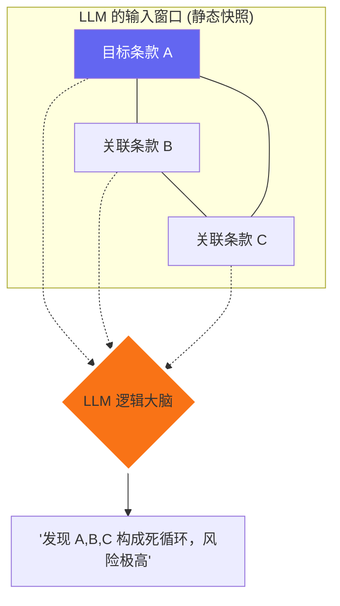
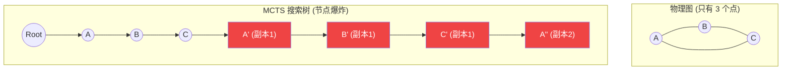
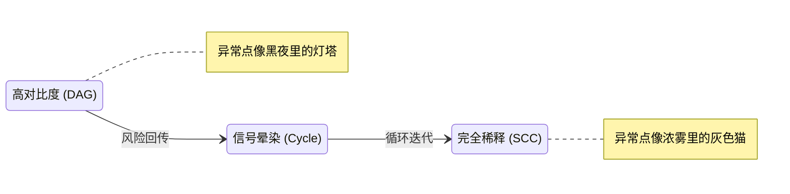

# Ablation 1: MCTS 失效模式深度解析 (极详尽版)

本指南旨在通过图解方式，详细解释为什么传统的蒙特卡洛树搜索 (MCTS) 在处理法律合同中的**有环图 (Cyclic Graphs/SCCs)** 时会失效，以及 SA-MCGS 是如何解决这些问题的。

---

## 1. 窗口化评估：从“递归死循环”到“静态快照”

### 为什么传统 MCTS 会死循环？
MCTS 的评估依赖于 **Rollout (执行流)**。它像是一个旅行者，每到一个路口问一次路。在有环图中，这变成了递归的跳转。
```mermaid
sequenceDiagram
    participant E as MCTS 引擎
    participant G as 关系图
    Note over E,G: 递归执行模式 (Recursive)
    E->>G: A 的下一步是谁?
    G->>E: 是 B
    E->>G: B 的下一步是谁?
    G->>E: 是 C
    E->>G: C 的下一步是谁?
    G->>E: 是 A (回到起点)
    Note red over E,G: 死循环开始：A -> B -> C -> A ...
```

### 为什么窗口评估 (SA-MCGS) 能终止？
SA-MCGS 将评估转变为 **模式识别 (Pattern Recognition)**。它不跳转，而是把结构“拍扁”成文字。

**本质区别**：
- **MCTS** 是在**执行**这个环（像程序死机）。
- **SA-MCGS** 是在**阅读**这个环（像看一张地图，地图上有环，但看地图的人不会转圈）。

---

## 2. 搜索树膨胀 (F1)：内存中的“多重影分身”

### 物理世界 vs. MCTS 的精神世界
在物理图里，节点是唯一的。但在 MCTS 的搜索树里，**“路径即节点”**。



### 如何看懂 6.4x 的膨胀比？
- **1.0x (理想)**：每个条款只研究一次。
- **2.3x (DAG)**：由于不同路径到达同一点，产生少量副本。
- **6.4x (Cycle)**：意味着算法 **85% 的精力** 都在研究“影分身”。
- **后果**：如果你有 100 次调用 LLM 的预算，MCTS 会把 85 次花在同一个环的反复展开上，而剩下的 15 次根本不足以覆盖整份合同。

---

## 3. Rollout 陷阱 (F2)：为什么是“平均值”？

### 动态演示：随机游走的“均匀化”过程
假设环 `A-B-C-D` 中，只有 **D** 是有毒的 (Risk=1.0)，其他为 0。

| 步数 | 当前位置 | 路径累积风险 | 当前平均分 (Sum/Steps) |
| :--- | :--- | :--- | :--- |
| 1 | A | 0 | 0.00 |
| 2 | B | 0 | 0.00 |
| 3 | C | 0 | 0.00 |
| 4 | **D** | 1.0 | 0.25 |
| ... | ... | ... | ... |
| 8 | **D** | 2.0 | 0.25 |
| 30 | (截断) | 7.5 | **0.25** |

**结论**：
无论你从环里的哪一点出发，只要走得足够长（被截断），你经过 D 的次数比例是固定的（1/4）。
因此，**所有环内节点的 Rollout 返回值都会趋向于 0.25**。
> **算法直觉失效**：它分不清 0.25 是因为“全员小风险”还是“一个大毒药+三个无辜者”。

---

## 4. Q值稀释 (F3)：风险信号的“热力扩散”

这是 Q 值随时间演化的动态模拟：

### 阶段 A：初始探测 (信号清晰)
只有 D 被发现有风险。
`[A: 0.1] -> [B: 0.1] -> [C: 0.1] -> [D: 0.9]`  
**Spread = 0.8** (极好定位)

### 阶段 B：多次回传 (信号扩散)
由于环的存在，D 的风险开始“传染”给前驱。
`[A: 0.2] -> [B: 0.3] -> [C: 0.5] -> [D: 0.8]`  
**Spread = 0.6** (开始模糊)

### 阶段 C：最终平衡 (信号湮灭)
风险在环内反复震荡，最终达成“热平衡”。
`[A: 0.44] -> [B: 0.45] -> [C: 0.46] -> [D: 0.45]`  
**Spread = 0.02** (完全失效)



**SA-MCGS 的降维打击**：
它在“浓雾”形成之前，直接把整个环（SCC）**坍缩**成一个点。先判定“这团雾里有猫”，再进入内部用**窗口化手电筒**精准照射，从而强制维持了 **阶段 A** 的高对比度。
