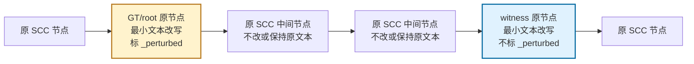
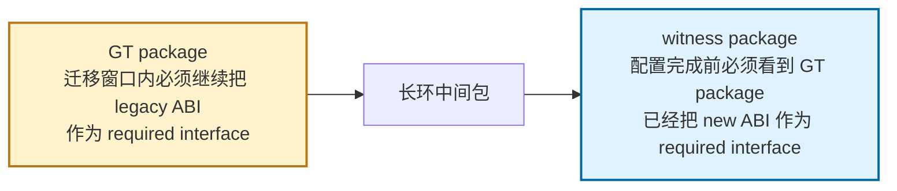
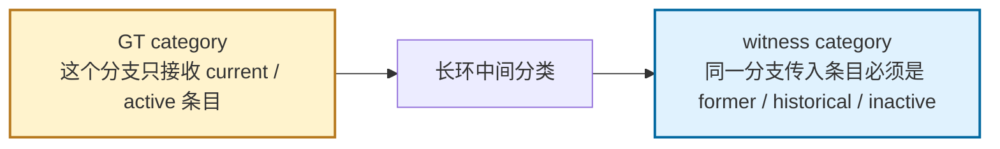
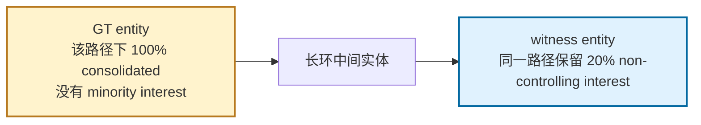

# Structural Simple Memory Stress 实验分析

最后更新：2026-05-13  
当前状态：**新正式口径；已完成 5-24 Naive calibration 与 24-node SA-MCGS pilot**  
实验 profile：`--inject --inject-profile memory_stress`  
内部版本：`structural_simple_v1`

---

## 1. 一句话结论

新的 `memory_stress` 不再是“把事故文本藏进长文本里”，而是把实验改成更朴素、更结构化的问题：

> 在原 SCC 的两个已有节点上写入彼此冲突但单看合理的约束，让 one-shot Naive 和 SA-MCGS 都在通用图分析任务下寻找结构不一致。

这比旧实验更干净，因为它不依赖显眼事故词，也不要求模型被提示去找 CVE、taxonomy error 或 ownership anomaly。

---

## 2. 当前正式协议

| 项目 | 新口径 |
|---|---|
| 注入 profile | `memory_stress` |
| 内部版本 | `structural_simple_v1` |
| 是否新增节点 | **不新增** |
| 修改节点 | 原 SCC 中 1 个 GT/root + 1 个 witness |
| GT 标记 | 只有 root 节点标 `_perturbed` |
| witness 标记 | 不标 `_perturbed`，只作为证据节点 |
| 节点距离 | 长环默认约半环距离，小环用可用最大距离 |
| Prompt | Naive 和 SA-MCGS 都使用通用 directed-graph consistency/risk prompt |
| 旧结果 | 只作为 legacy diagnostic，不进主结果 |

关键 metadata：

| 字段 | 含义 |
|---|---|
| `_inject_profile_version` | `structural_simple_v1` |
| `_inject_witness_node` | 与 GT 形成冲突的远距离原节点 |
| `_inject_witness_distance` | witness 相对 GT 的环上距离 |
| `_inject_evidence_nodes` | `[target, witness]` |
| `_inject_conflict_template` | 三域具体冲突模板 |

---

## 3. 注入机制



这里的关键不是“必须走完整个环才发现问题”，而是：

- SCC 本身可能很长，导致 one-shot prompt 很长。
- 缺陷证据被分散在两个远距离节点。
- 两个节点单看都合理，但组合后形成明显冲突。
- SA-MCGS 的价值是用窗口搜索和反复局部评估稳定恢复冲突源。

---

## 4. 三域具体例子

### Debian



通俗解释：  
一个包说“迁移窗口还没结束，所以大家必须继续按旧接口来”；另一个远处的包说“我只有看到它已经切到新接口，才能完成配置”。两个规定单看都像正常发布流程，放在同一个依赖链里就冲突：旧接口和新接口都被要求先成立。

冲突模板：`debian_legacy_abi_vs_new_abi`

### Wikipedia



通俗解释：  
一个分类分支说“这里只放当前还活跃的对象”；远处另一个分类说“从这个分支来的对象只能是历史的、已经不活跃的”。单看都可能是合理的分类规则，但同一条链上不能同时要求对象既 active 又 inactive。

冲突模板：`wikipedia_current_active_vs_historical_inactive`

### SEC EX-21



通俗解释：  
一个实体披露说“这条合并路径是 100% 合并，没有少数股东权益”；远处另一个实体说“同一条路径还保留 20% 少数股东权益”。单条会计备注都能理解，但合起来账不平。

冲突模板：`sec_full_consolidation_vs_retained_interest`

---

## 5. Prompt 口径

旧 prompt 有领域定向提示，例如 CVE、taxonomy DAG、circular ownership。新 prompt 已改成通用任务：

> You are analyzing a directed graph of interdependent records.

模型只被要求根据：

- record text
- directed edges
- structural inconsistency
- mutually incompatible conditions
- high-impact records

来判断风险。  
这保证 Naive 和 SA-MCGS 比的是推理与搜索方式，而不是谁被 prompt 明示了领域错误类型。

---

## 6. 5-24 Naive Calibration 结果

本轮结果文件：

```text
experiments/cross_domain/results/battle_inject_memory_stress_rankednaive_naiveonly_1778652713.json
```

实验范围：

| 维度 | 设置 |
|---|---|
| Domains | Debian / Wikipedia / SEC EX-21 |
| Sizes | 5 / 8 / 12 / 16 / 24 |
| Models | gpt-4o / deepseek-v3 |
| Method | ranked Naive only |
| Cases | 30 |

### 6.1 总体结论

**新注入是有效的，但它更像“双证据结构冲突”，不是单点异常。**

Naive 在 root-only 口径下并不总能把 GT/root 排到第一；但它几乎总能把 root 或 witness 放进 Top-3。这说明新任务不是“模型完全看不见风险”，而是“模型经常先抓到冲突另一端 witness，再抓到 GT/root”。

| Metric | Result | Interpretation |
|---|---:|---|
| Root Top-1 | 6/30 | root 不是最容易被直接选中的单点 |
| Root Top-3 | 29/30 | root 通常仍能进入候选核心 |
| Evidence-pair Top-1 | 21/30 | Top-1 经常是 root 或 witness 之一 |
| Evidence-pair Top-3 | 30/30 | 所有 case 都至少抓到一端证据 |
| Both evidence in Top-3 | 22/30 | 多数 case 能同时抓到 root+witness |
| Avg root rank | 1.90 | root 通常在前两名附近 |

这里最重要的是：**以后主指标不能只看 root rank，也要报告 evidence-pair localization**。否则 witness 被排第一会被错误地记成失败。

### 6.2 长度效应

| Size | Cases | Root Top-1 | Root Top-3 | Evidence Top-1 | Evidence Top-3 | Both Evidence Top-3 | Avg Root Rank |
|---:|---:|---:|---:|---:|---:|---:|---:|
| 5 | 6 | 0/6 | 6/6 | 0/6 | 6/6 | 0/6 | 2.00 |
| 8 | 6 | 2/6 | 6/6 | 6/6 | 6/6 | 6/6 | 1.67 |
| 12 | 6 | 1/6 | 6/6 | 4/6 | 6/6 | 5/6 | 2.00 |
| 16 | 6 | 3/6 | 6/6 | 6/6 | 6/6 | 6/6 | 1.50 |
| 24 | 6 | 0/6 | 5/6 | 5/6 | 6/6 | 5/6 | 2.33 |

24-node 已经开始有更清楚的压力信号：

- root Top-1 降到 0/6。
- root Top-3 仍有 5/6，说明不是完全失效。
- evidence-pair Top-3 仍是 6/6，说明模型抓到了结构冲突的一端。

这符合目前预期：**24 不需要夸张到 48，就已经足够制造 root localization 的不稳定。**

### 6.3 Domain 效应

| Domain | Cases | Root Top-1 | Root Top-3 | Evidence Top-1 | Evidence Top-3 | Both Evidence Top-3 | Avg Root Rank |
|---|---:|---:|---:|---:|---:|---:|---:|
| Debian | 10 | 1/10 | 10/10 | 8/10 | 10/10 | 8/10 | 1.90 |
| Wikipedia | 10 | 2/10 | 9/10 | 6/10 | 10/10 | 6/10 | 2.10 |
| SEC EX-21 | 10 | 3/10 | 10/10 | 7/10 | 10/10 | 8/10 | 1.70 |

旧实验里只有 Wikipedia 有明显差距，主要是旧 prompt 和旧注入造成的 confound。新口径下三域都能产生结构冲突，但 Wikipedia 仍略难，表现为 root rank 更靠后、both evidence Top-3 更低。

### 6.4 24-node case 明细

24-node 的 GT/root 是 `node_18`，witness 是半环距离的 `node_06`。

| Domain | Model | Root Rank | Top-5 Nodes | Interpretation |
|---|---|---:|---|---|
| Debian | gpt-4o | 2 | 06, 18, 24, 01, 02 | witness 第一，root 第二 |
| Debian | deepseek-v3 | 2 | 06, 18, 05, 01, 24 | witness 第一，root 第二 |
| Wikipedia | gpt-4o | 4 | 01, 24, 06, 18, 02 | 当前最难 case，root 掉出 Top-3 |
| Wikipedia | deepseek-v3 | 2 | 06, 18, 01, 24, 05 | witness 第一，root 第二 |
| SEC EX-21 | gpt-4o | 2 | 06, 18, 01, 24, 02 | witness 第一，root 第二 |
| SEC EX-21 | deepseek-v3 | 2 | 06, 18, 01, 24, 05 | witness 第一，root 第二 |

这个表的含义很明确：Naive 不是完全失败，而是在双证据冲突里倾向先抓 witness。论文里如果只写 root Top-1，会把现象讲窄；如果写 root rank + evidence-pair localization，会更真实，也更有说服力。

## 7. 24-node SA-MCGS Pilot

本轮结果文件：

```text
experiments/cross_domain/results/battle_inject_memory_stress_rankednaive_samcgsonly_1778653231.json
```

实验范围：

| 维度 | 设置 |
|---|---|
| Domains | Debian / Wikipedia / SEC EX-21 |
| Size | 24 |
| Models | gpt-4o / deepseek-v3 |
| Method | SA-MCGS only |
| Cases | 6 |

### 7.1 先说关键判断

**SA-MCGS 不能按 root-only Top-3 直接宣称胜利。**

它稳定把 witness 排到 Top-1，但没有稳定把 root/GT 排回 Top-3。这说明当前 SA-MCGS 的窗口搜索确实抓到了冲突证据，但聚合/回传机制更偏向 witness 端。

| Metric | Result | Interpretation |
|---|---:|---|
| Root Top-1 | 0/6 | root 没有被稳定排第一 |
| Root Top-3 | 1/6 | root-only 口径下表现差 |
| Evidence-pair Top-1 | 6/6 | 每个 case 的第一名都是 root 或 witness |
| Evidence-pair Top-3 | 6/6 | 每个 case 都抓到至少一端证据 |
| Both evidence in Top-3 | 1/6 | root+witness 同时进入 Top-3 还不稳定 |
| Avg root rank | 10.83 | root 被窗口证据稀释，排名明显靠后 |

### 7.2 Blind Risk Subgraph

这里只看 blind risk subgraph，不使用 GT anchor。

| Domain | Model | Blind Size | Contains Root | Contains Witness | Contains Both |
|---|---|---:|---|---|---|
| Debian | gpt-4o | 3/24 | No | Yes | No |
| Debian | deepseek-v3 | 5/24 | Yes | Yes | Yes |
| Wikipedia | gpt-4o | 6/24 | No | Yes | No |
| Wikipedia | deepseek-v3 | 7/24 | No | Yes | No |
| SEC EX-21 | gpt-4o | 4/24 | No | Yes | No |
| SEC EX-21 | deepseek-v3 | 5/24 | No | Yes | No |

这张表比 posthoc GT-anchored subgraph 更重要。它说明：

- SA-MCGS blind subgraph 6/6 保留 witness。
- 只有 1/6 同时保留 root+witness。
- 当前风险子图能压缩到 3-7 个节点，但还不能稳定恢复完整 evidence pair。

### 7.3 对当前效果的判断

目前最可靠的结论是：

> structural_simple_v1 已经制造了可解释的结构冲突；Naive 在 24-node 里出现 root localization drop；SA-MCGS 能稳定抓到 witness 端，但还需要改进或补充指标，才能把 root+witness pair 作为正式主结果。

这比旧实验干净很多，但还没有到可以直接写成 “SA-MCGS 完胜 Naive” 的状态。

## 8. 下一步实验 Todo

优先级从高到低：

| Priority | Todo | Why |
|---:|---|---|
| P0 | 在 result JSON 中显式保存 witness metadata | 现在 witness 需要从 size 推断，正式分析不应依赖推断 |
| P0 | 增加 evidence-pair metrics | root-only 不适合双节点结构冲突 |
| P0 | 区分 blind subgraph 与 posthoc GT-anchored subgraph | 避免再把不可用于主结果的指标写进结论 |
| P1 | 重跑 SA-MCGS 5/8/12/16/24 | 看窗口搜索随长度变化是否比 Naive 更稳 |
| P1 | 检查 SA-MCGS 聚合是否能把 witness 证据回传到 root | 当前 witness Top-1 稳，但 root rank 不稳 |
| P2 | 只在必要时扩展到 32/48 | 24 已有压力信号，不急着扩大成本 |

建议 rerun 顺序：

| 阶段 | 目的 | 范围 |
|---|---|---|
| Metric Fix | 保存 witness + pair metrics | 不需要 API |
| SA-MCGS Length Run | 看 5-24 长度效应 | synthetic 5/8/12/16/24，三域，双模型 |
| Aggregation Debug | 看为什么 witness 稳、root 不稳 | 重点看 24-node windows |
| Formal Run | 论文主表 | 选 12/16/24，三域，双模型，Naive + SA-MCGS |

验收标准：

- Naive 不是全 Top-1。
- SA-MCGS 的 Top-k 和 OC 分开报告。
- risk subgraph 使用 blind fields，不用 GT anchor。
- 至少一个 setting 能显示长 SCC 下 one-shot rank drop，而 SA-MCGS 恢复 Top-3 或更好。

---

## 9. 当前代码验证

已完成的代码层验证：

| 检查 | 状态 |
|---|---|
| `memory_stress` 不新增节点 | 已测 |
| 只有 GT/root 标 `_perturbed` | 已测 |
| witness 是原 SCC 节点且不等于 GT | 已测 |
| 长环 witness 距离约半环 | 已测 |
| 三域均生成 target+witness 冲突 | 已测 |
| 注入文本不含显性泄漏词 | 已测 |
| 通用 prompt 不含领域定向找错词 | 已测 |

最近验证命令：

```text
python -m py_compile experiments/cross_domain/inject_defect.py experiments/cross_domain/run_cross_domain_battle.py
pytest tests/test_cross_domain_inject_defect.py -q
pytest tests/test_pipeline.py tests/test_experiments.py tests/test_cross_domain_inject_defect.py -q
git diff --check
```
